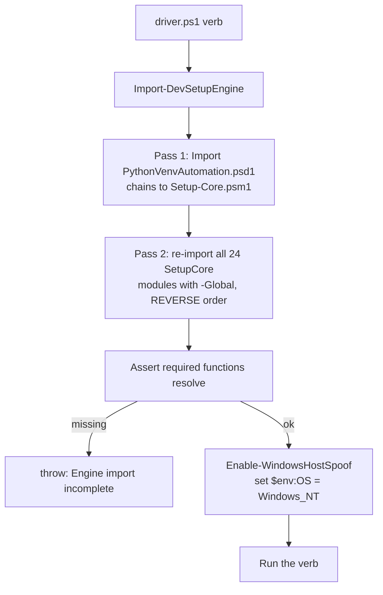
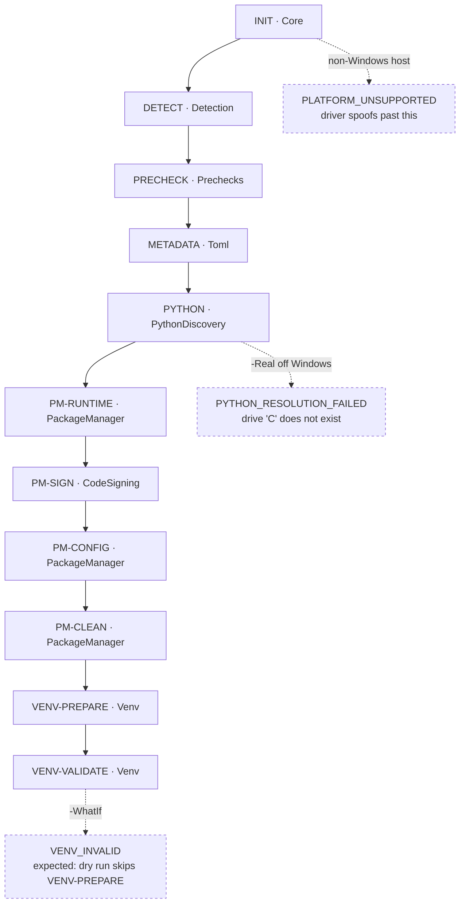

# Run PythonVenvAutomation (devsetup)

Windows-targeted PowerShell automation that creates, repairs, signs and activates
Python virtual environments, exposed to end users as a single `devsetup` command.

It is **driven programmatically** by `.claude/skills/run-python-venv-automation/driver.ps1`.
There is no GUI. All paths below are relative to the repo root.

**It runs on macOS/Linux far further than the README implies** — the "Windows-only"
guard is a single `$env:OS` check, and the driver flips it. See
[Platform ceiling](#platform-ceiling) for exactly where it stops.

## Prerequisites

Verified on macOS 25.6 (arm64), PowerShell 7.5.5, Pester 5.7.1.

```bash
pwsh -v            # PowerShell 7+ (or Windows PowerShell 5.1)
```

If Pester is missing or older than 5:

```bash
pwsh -NoProfile -Command "Install-Module Pester -MinimumVersion 5.0 -Scope CurrentUser -Force -SkipPublisherCheck"
```

No Python, `uv` or `poetry` is required for anything in this skill — the dry-run
pipeline never shells out to them.

## Run (agent path) — use this first

Everything goes through one driver. It takes a verb as its first positional arg.

```bash
pwsh -NoProfile -File .claude/skills/run-python-venv-automation/driver.ps1 selftest
```

That is the one-shot "is this repo healthy" check. Expected output:

```
==> Self-test: engine import + syntax + detection + pipeline
  [ok] engine imported, all required functions resolvable
  [ok] all PowerShell files parse
  [ok] detection returns poetry for a poetry project
  [ok] dry-run pipeline reaches VENV-VALIDATE (10 steps)
SELF-TEST PASSED
```

### Verbs

| Command | What it does |
|---|---|
| `selftest` | Engine import + syntax parse of every `.ps1`/`.psm1` + detection + a full dry-run pipeline. Start here. |
| `test` | Pester suite + 70% coverage gate. Add `-SkipSigningTests` off Windows. |
| `info` | `Get-PythonVenvSetupInfo` — command name, shim paths, engine path, auto-update config. |
| `detect` | `Resolve-PackageManager` across four generated pyproject fixtures. |
| `pipeline` | Runs the real `Invoke-PythonVenvSetup` orchestration. `-WhatIf` by default; `-Real` to actually mutate. |
| `fixtures` | Writes the small fixture projects and exits. |
| `dummy` | Builds the full dummy workspace: 11 project layouts + 7 real Git repos with real upstreams (`tests/dummy/New-DummyProject.ps1`). |
| `matrix` | Runs every host-runnable feature against that workspace and prints a PASS/FAIL/SKIP matrix (`tests/dummy/Invoke-FeatureMatrix.ps1`). |
| `exec` | Evaluates `-Script <snippet>` or `-File <path.ps1>` with the whole engine loaded. **This is the direct-invocation path** — use it to call any internal function. |

Useful flags: `-ProjectPath <dir>` (`detect`, `pipeline`), `-WorkDir <dir>`
(where fixtures land, default `$TMPDIR/devsetup-driver`), `-Real`, `-NoCoverage`.

### How the driver gets the engine loaded



The nested-import bug that made pass 2 necessary is now **fixed in the source**
(all 38 nested imports use `-Global`), so a bare `Import-Module Setup-Core.psm1`
loads all 24 modules. Pass 2 is kept as a cheap belt-and-braces step plus an
explicit assertion, so a regression fails loudly here instead of halfway through
a pipeline run.

### Direct invocation (most PRs need only this)

Call any internal function with the engine live:

```bash
pwsh -NoProfile -File .claude/skills/run-python-venv-automation/driver.ps1 exec -Script '
$c = Get-SetupConstants
"ConfigFileName     : " + $c.ConfigFileName
"DefaultPullStrategy: " + $c.Git.DefaultPullStrategy
"Get-VenvPythonExe  : " + (Get-VenvPythonExe -VenvDir "/tmp/x/.venv")
'
```

Verified output:

```
ConfigFileName     : .setup-config.json
DefaultPullStrategy: SkipIfDirty
Get-VenvPythonExe  : /tmp/x/.venv/Scripts/python.exe
```

### The setup pipeline

```bash
pwsh -NoProfile -File .claude/skills/run-python-venv-automation/driver.ps1 pipeline
```



A dry run **ends in a `VENV_INVALID` failure and that is the expected result** —
`-WhatIf` skips `VENV-PREPARE`, so `VENV-VALIDATE` finds no `.venv`. Reaching
that step means all 10 steps executed. The step is not dry-run aware; treat a
run that stops *earlier* as the real regression signal.

### Platform ceiling

| Mode | Reaches | Stops because |
|---|---|---|
| `pipeline` (dry run) | all 10 steps → `VENV-VALIDATE` | `-WhatIf` skipped venv creation (expected) |
| `pipeline -Real` | 3 steps → dies in `PYTHON` | `PythonDiscovery` enumerates `C:\` — "A drive with the name 'C' does not exist" |

`DETECT`, `PRECHECK` and `METADATA` execute for real in both modes, so
detection, precheck and TOML-parsing changes are fully testable here. Anything
touching `PythonDiscovery`, `Venv`, or `CodeSigning` needs a Windows host or CI.

## Test

```bash
pwsh -NoProfile -File .claude/skills/run-python-venv-automation/driver.ps1 test -SkipSigningTests
```

Verified: `Passed=395 Failed=0 Skipped=0`, `Coverage: 86,31%` (gate is 70%).

The project's own runner works too and is what CI calls, but it fails off Windows:

```bash
pwsh -NoProfile -File ./Run-Tests.ps1 -MinimumCoverage 70
```

→ `Pester failed: tests=5, containers=0, blocks=0` — the 5 `CodeSigning.Tests.ps1`
cases. Everything else (395 tests) and the coverage gate (`Covered 86,31% / 70%`)
pass. Use `driver.ps1 test -SkipSigningTests` locally and let CI
(`windows-latest`) run the full suite.

There is also a Python suite for `scripts/bump-version.py`:

```bash
.venv/bin/python -m pytest tests/python -q
```

Verified: `27 passed`.

### End-to-end feature matrix

```bash
pwsh -NoProfile -File .claude/skills/run-python-venv-automation/driver.ps1 matrix
```

Verified: `FEATURE MATRIX  PASS=76  FAIL=0  SKIP=6`. It drives package-manager
detection, Python constraints, project metadata, **real** Safe Git Sync against
real repositories with real upstreams, project config, structured logging, the
dry-run pipeline, pyproject health, transactional healing, dependency semantics,
the doctor/repair/support commands and version bumping. The 6 SKIPs are the
genuinely Windows-only features, each with a printed reason. Results are written
to `<workdir>/dummy/feature-matrix.json`.

## Build

```bash
pwsh -NoProfile -File ./build/Build.ps1
```

Works on macOS. Verified output:

```
Version check OK: 1.0.0
Staged manifest validated.
Wrote .../artifacts/PythonVenvAutomation-1.0.0.zip
Wrote .../artifacts/nuget/PythonVenvAutomation.1.0.0.nupkg
```

`artifacts/` and `PythonVenvAutomation/engine/` are gitignored. The version in
`VERSION` and in `PythonVenvAutomation.psd1` must match or the build fails —
`build/Update-Version.ps1` keeps them in sync.

## Run (human path)

End users never touch any of the above. They run `Install-DevSetupCommand` once,
which writes a `devsetup.cmd`/`devsetup.ps1` shim into
`%LOCALAPPDATA%\Company\PythonVenvAutomation\bin` and puts it on the user PATH;
afterwards they only type `devsetup`. This is Windows-only and interactive —
`Invoke-PythonVenvSetup` without `-NonInteractive` prompts with a
`Read-Host` mode menu, so never call it that way from an agent.

Reference docs: `scripts4PythonAutomation/Flow.md` (mermaid flowcharts of the
whole engine), `PythonVenvAutomation/docs/`, and
`pwsh -NoProfile -File ./scripts4PythonAutomation/Get-SetupHelp.ps1`.

## Gotchas

- **Nested `-Force` imports without `-Global` de-globalize their dependencies.**
  `-Force` *relocates* an already-global module into the importer's private
  session state. This used to leave only 11 of 24 modules reachable, killing the
  pipeline at `METADATA` with *"The term 'Get-ProjectMetadata' is not
  recognized"*, and it also created duplicate module instances with **separate
  caches**. Fixed in the source (all 38 nested imports use `-Global`); keep it
  that way when adding a module, and load via `Import-DevSetupEngine` anyway so
  a regression is caught by its assertion.

- **The "Windows-only" guard is one env var.** `Setup-Core.psm1:245` throws
  `PLATFORM_UNSUPPORTED` unless `Get-IsWindows` is true, and `Compat.psm1:83`
  defines that as `$env:OS -eq 'Windows_NT'`. Setting `$env:OS='Windows_NT'` is
  enough — no source patch. The driver does this in `Enable-WindowsHostSpoof`.

- **INIT requires an existing DigiCert executable path** even with
  `-EnableCodeSigning:$false` — the check runs before the flag is consulted.
  Without it: `DIGICERT_NOT_FOUND`. The driver passes an empty stub file.

- **`Get-VenvPythonExe` always returns `Scripts\python.exe`**, hardcoded for
  Windows, so anything that resolves a venv interpreter cannot work off Windows
  regardless of the spoof.

- **`Invoke-PythonVenvSetup` prompts** unless `-NonInteractive` is passed. It also
  runs a git pull by default — pass `-SkipGitPull` for scratch projects.

- **Running tests dirties the repo.** `Run-Tests.ps1` writes `test-results.xml`
  and `coverage.xml` to the repo root and neither is in `.gitignore`. Since the
  automation's own git sync defaults to `SkipIfDirty`, this can silently change
  behaviour on a later run. Delete them or add them to `.gitignore`.

- **Detection is fail-closed on ambiguity.** A PEP 621-only pyproject, or one
  with both `uv.lock` and `poetry.lock`, resolves to `Status = Ambiguous` with
  `PYPROJECT_PM_AMBIGUOUS` / `PYPROJECT_MULTIPLE_LOCKFILES`. Non-interactive
  callers get a `SetupException`; interactive ones get a prompt. Lock-file
  mtime is deliberately not a tie-breaker. `driver.ps1 detect` prints all four
  fixture outcomes.

- **`Exit-WithError` used to hang unattended runs** on `Press Enter to exit`.
  It now checks `Test-SetupInteractive` (`DEVSETUP_NONINTERACTIVE`, `CI`,
  `TF_BUILD`, `GITHUB_ACTIONS`, redirected stdin, non-interactive host). Set
  `DEVSETUP_NONINTERACTIVE=1` for any scripted run.

- **CI is `windows-latest` only** (`.github/workflows/publish.yml`). Treat green
  local runs as a smoke check; the Windows-only paths are only genuinely
  validated there.

### PowerShell traps that caused real bugs here

Each of these produced a working-looking-but-wrong result in this repo and is
now pinned by a test. `PythonVenvAutomation/docs/MODULE_ARCHITECTURE.md` has the
same table with more context.

| Trap | Symptom | Fix |
|---|---|---|
| `@($genericList)` | throws `Argument types do not match` on PS 7.5.x — even for an empty list | `.ToArray()` |
| `return , $collection` | pipeline consumers see **one array object**, so `\| ForEach-Object Code` yields `$null`, and `@()` counts an empty result as 1 | return collections unwrapped |
| `@(Get-Foo)` where `Get-Foo` does `return ,$node` | a 1-element array *containing* the array; a `[string[]]` parameter then flattens it into one joined string | assign first, then `@()` |
| Mandatory `[string]` / `[string[]]` | rejects `''` and any array containing an empty string (blank lines!) with "because it is an empty string" | `[AllowEmptyString()]` |
| `$WhatIfPreference` | does **not** cross module boundaries, so `-WhatIf` silently performed real writes | forward explicitly: `-WhatIf:$WhatIfPreference` |
| `Read-Host` in an error path | blocks an unattended run forever | gate on `Test-SetupInteractive` |

- **The dummy generator writes `pyproject.toml` first on purpose.** A plain
  `@{}` hashtable has no key order, so lock files could otherwise be written
  before `pyproject.toml` and trip a spurious `LOCK_OUTDATED`.

## Troubleshooting

| Symptom | Fix |
|---|---|
| `The term 'Get-SetupConstants' is not recognized` | You imported the module directly. Use `driver.ps1 exec` / `Import-DevSetupEngine`. |
| `The term 'Get-ProjectMetadata' is not recognized` at step `METADATA` | Same cause — the reverse-order second pass did not run. |
| `This setup automation is Windows-only.` (`PLATFORM_UNSUPPORTED`) | Set `$env:OS='Windows_NT'`; the driver does it for you. |
| `DigiCert Utility not found` (`DIGICERT_NOT_FOUND`) | Pass `-DigiCertUtilityExe <path to any existing file>`; the driver uses a stub. |
| `Cannot find drive. A drive with the name 'C' does not exist.` | You used `pipeline -Real` off Windows. Expected — drop `-Real`. |
| `.venv directory was not created` (`VENV_INVALID`) after 10 steps | Expected outcome of a dry run. Not a failure. |
| `Could not find Command Get-AuthenticodeSignature` (×5) | `CodeSigning.Tests.ps1` off Windows. Use `test -SkipSigningTests`. |
| `Pester 5 or newer is required` | `Install-Module Pester -MinimumVersion 5.0 -Scope CurrentUser -Force -SkipPublisherCheck` |
| A run hangs with no output | Something reached `Read-Host`. Re-run with `DEVSETUP_NONINTERACTIVE=1`. |
| `Argument types do not match` | `@()` around a `List[object]` — use `.ToArray()`. |
| `Cannot bind argument to parameter 'X' because it is an empty string` | Mandatory `[string[]]` receiving an array with blank entries — add `[AllowEmptyString()]`. |
| `Mock data are not setup for this scope` | Pester's `Mock`/`InModuleScope` only work inside `Invoke-Pester`; don't call them from a plain script. |
