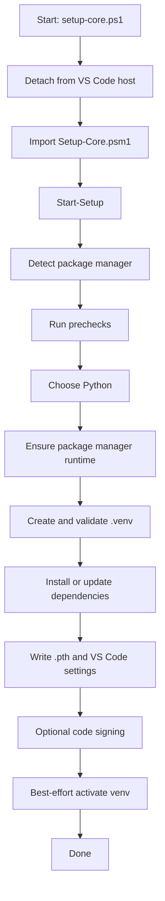
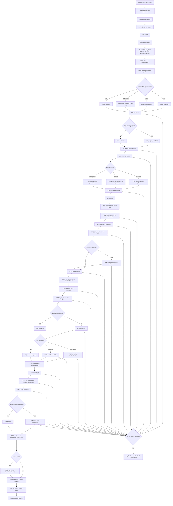

# Python Venv Automation Flowcharts

This document contains two Mermaid diagrams for the automation in `python_venv_Automation`:

- A compact demo flow for quick presentation
- A development flow that shows the real orchestration path and key branching points

## Demo Flow

## Development Flow

