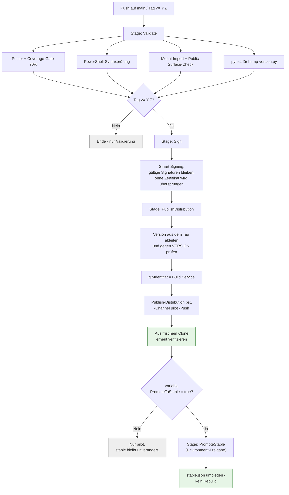

# Azure DevOps Distribution

**Zielgruppe:** CI/Admin

## Was die Pipeline tut



## Keine PATs

Der Push läuft über die Build-Service-Identität:

```yaml
- checkout: self
  fetchDepth: 0
  persistCredentials: true
```

`persistCredentials` legt das Pipeline-Token in der git-Konfiguration des
Checkouts ab. `git push` funktioniert damit ohne jedes Secret im YAML.
`tests/Pipeline.Tests.ps1` prüft, dass keine Token-Literale im YAML stehen.

## Loop-Guard

Die Pipeline pusht auf `distribution`. Ohne Ausschluss würde dieser Push die
Pipeline erneut starten:

```yaml
trigger:
  branches:
    include: [ main ]
    exclude: [ distribution ]
```

## Berechtigungen

| Gruppe | Recht | Warum |
|---|---|---|
| Users | Read | `devsetup` klont den Distribution-Branch |
| Developers | Read | dito; Releases entstehen nur über die Pipeline |
| `<Projekt> Build Service (<Org>)` | Read + **Contribute** | die Pipeline committet und pusht Releases |

Einzurichten unter *Project Settings → Repositories → \<Repo\> → Security*.

## Release-Ablauf

1. `VERSION` auf die neue SemVer-Version setzen und mergen.
2. Tag `vX.Y.Z` setzen und pushen.
3. Pipeline validiert, signiert, veröffentlicht nach `packages/X.Y.Z` und
   setzt **pilot** auf die neue Version.
4. Tester (`Channel = pilot`) bekommen sie beim nächsten `devsetup`.
5. Nach erfolgreichem Pilot: Pipeline mit `PromoteToStable=true` erneut
   ausführen. Es wird **nichts neu gebaut**, nur `stable.json` umgebogen.

## Manuell veröffentlichen

```powershell
# Lokal bauen und committen, ohne zu pushen
./build/Publish-Distribution.ps1 -Version 1.9.0 -Channel pilot -Confirm:$false

# Veröffentlichen
./build/Publish-Distribution.ps1 -Version 1.9.0 -Channel pilot -Push -Confirm:$false

# Nur den Channel umbiegen (Package existiert bereits)
./build/Publish-Distribution.ps1 -Version 1.9.0 -Channel stable -Push -Confirm:$false
```

> **Hinweis:** `pwsh -File script.ps1 -Version 1.9.0` funktioniert, aber in
> einer bash-Shell wird `-Confirm:$false` von der Shell zerlegt. Innerhalb von
> PowerShell oder mit `pwsh -Command '...'` aufrufen.

## Notfall: eine kaputte Version zurückziehen

Veröffentlichte Versionen sind unveränderlich und werden **nicht** gelöscht.
Stattdessen den Channel auf die letzte gute Version zurücksetzen:

```powershell
./build/Publish-Distribution.ps1 -Version 1.9.0 -Channel stable -Push -Confirm:$false
```

Clients, die die defekte Version bereits vergeblich aktiviert haben, laufen
ohnehin auf ihrer vorherigen Version weiter und haben die kaputte Version in
`failedVersions` vermerkt.

Wenn eine Version verpflichtend werden muss (z. B. Sicherheitsfix), zusätzlich
`-ForceChannel` setzen: Offline-Clients dürfen dann nicht mehr auf einer
älteren Version verbleiben.
