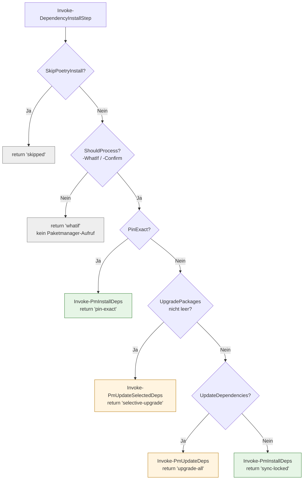
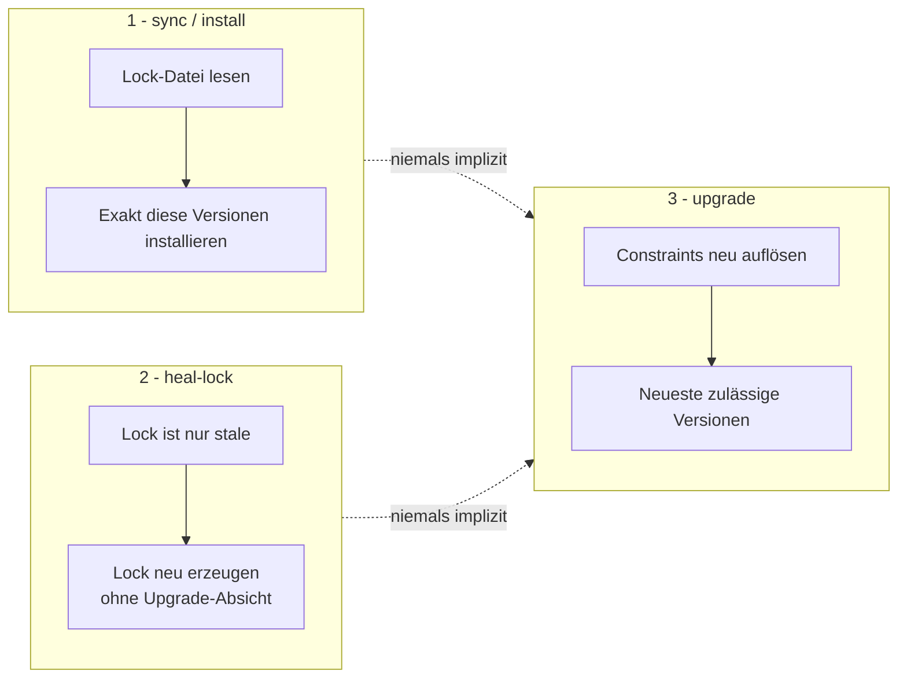

# Dependency-Semantik

**Zielgruppe:** End User, Developer
**Modul:** `scripts4PythonAutomation/SetupCore/modules/SetupSteps.psm1`

## Grundregel

Ein normaler `devsetup`-Lauf stellt den **gewünschten Zustand** her. Er
aktualisiert **keine** Abhängigkeiten auf neuere Versionen. Upgrades sind immer
eine bewusste Handlung.

Vorher rief `Invoke-DependencyInstallStep` am Ende bedingungslos
`Invoke-PmUpdateDeps` auf. Damit hat jede Arbeitsplatzvorbereitung die
Lock-Datei neu geschrieben und neue Upstream-Releases eingezogen — ohne dass
jemand danach gefragt hatte.

## Kommandos

| Kommando | Bedeutung | Interne Aktion |
|---|---|---|
| `devsetup` | Desired State herstellen | `Invoke-PmInstallDeps` (lock-konform) |
| `devsetup update` | vorhandenes `.venv` synchronisieren | `Invoke-PmInstallDeps` |
| `devsetup upgrade` | bewusst alle Abhängigkeiten aktualisieren | `Invoke-PmUpdateDeps` |
| `devsetup update -- -UpgradePackage my-lib` | nur ein Paket aktualisieren | `Invoke-PmUpdateSelectedDeps` |
| `devsetup -- -PinExact` | exakt die Lock-Versionen | `Invoke-PmInstallDeps` |

## Entscheidungsfluss

Selektives Upgrade hat Vorrang vor einem Pauschal-Upgrade: wer `-UpgradePackage`
angibt, meint genau dieses Paket.

## Drei getrennte Vorgänge

Lock-Healing und Dependency-Upgrade sind strikt getrennt. Eine veraltete
Lock-Datei zu reparieren heißt **nicht**, Pakete zu aktualisieren.

## Lock Health

`Test-PyProjectLockHealth` klassifiziert vor der Installation:

| Finding | Bedeutung | FixClass |
|---|---|---|
| `LOCK_MISSING` | Lock fehlt, kann aus `pyproject.toml` erzeugt werden | SafeAutoFix |
| `LOCK_OUTDATED` | Lock ist älter als `pyproject.toml` | SafeAutoFix |
| `LOCK_INVALID` | Lock ist leer oder unlesbar | NeedsDecision |
| `LOCK_WRONG_MANAGER` | Lock gehört zum anderen Paketmanager | NeedsDecision |
| `PYPROJECT_MULTIPLE_LOCKFILES` | `uv.lock` **und** `poetry.lock` | NeedsDecision |

Eine ungültige oder fremde Lock-Datei wird **nie** blind überschrieben.
