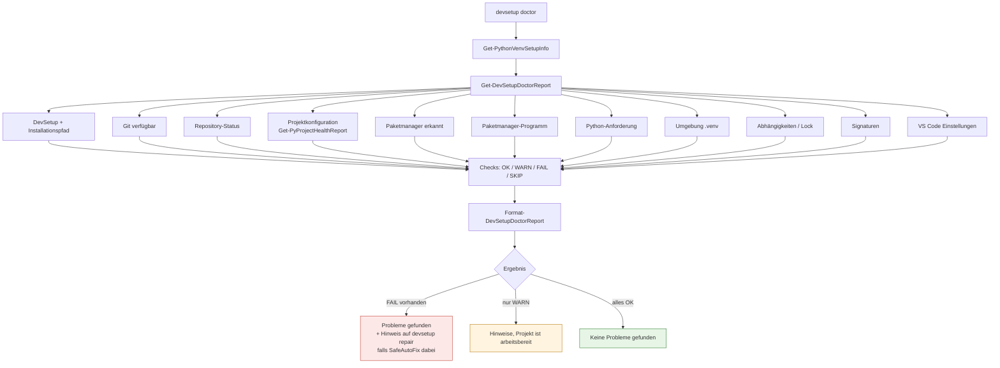

# devsetup doctor

**Zielgruppe:** End User, Support
**Modul:** `scripts4PythonAutomation/SetupCore/modules/Diagnostics.psm1`

## Garantie: read-only

`devsetup doctor` verändert **nichts**. Die Garantie ist strukturell:

- `Get-DevSetupDoctorReport` deklariert bewusst **kein** `SupportsShouldProcess`,
  weil es keine Aktion gibt, die das bräuchte.
- Jede Prüfung ist ein `Get-*` oder `Test-*`-Aufruf.
- Der Shim überspringt für `doctor` den Self-Update-Check, damit die Diagnose
  den Zustand meldet, den der Benutzer tatsächlich hat.

Getestet wird das über einen SHA256-Baum-Snapshot vor und nach zwei Läufen
(`tests/Commands.Tests.ps1`).

## Ablauf



Eine einzelne fehlschlagende Prüfung bricht den Report nicht ab: `Invoke-SafeProbe`
fängt sie ab und macht daraus eine rote Zeile.

## Beispielausgabe

```
DevSetup Diagnose

✓ DevSetup
✓ Installationspfad
✓ Git
✓ Projektkonfiguration
✓ Paketmanager
✓ Paketmanager-Programm
✓ Python-Anforderung
! Umgebung (.venv) - Noch nicht vorhanden.
✓ Abhaengigkeiten
! Signaturen - Signaturwerkzeug nicht gefunden.

Hinweise gefunden, das Projekt ist aber arbeitsbereit.
```

Bei einem mehrdeutigen Projekt:

```
✗ Projektkonfiguration - The package manager cannot be determined: ...
✗ Paketmanager - Nicht eindeutig - uv oder Poetry muss festgelegt werden.

Es wurden Probleme gefunden, die eine Entscheidung benoetigen.
```

## Status-Bedeutung

| Status | Zeichen | Bedeutung |
|---|---|---|
| OK | `✓` | Alles in Ordnung |
| WARN | `!` | Hinweis, Projekt bleibt arbeitsbereit |
| FAIL | `✗` | Muss behoben werden |
| SKIP | `-` | Auf dieser Plattform nicht anwendbar (nur mit `-Detailed` sichtbar) |

## Verwandte Kommandos

- `devsetup repair` — behebt genau die Findings mit `AutoFixable = true`
- `devsetup support` — erzeugt ein bereinigtes Support-Paket
- `devsetup about` — Version, Kanal, Installationspfad, Projektstatus
