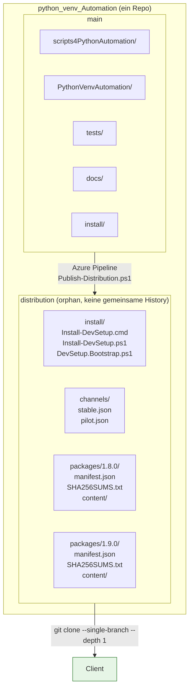
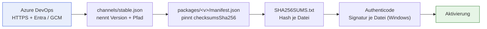
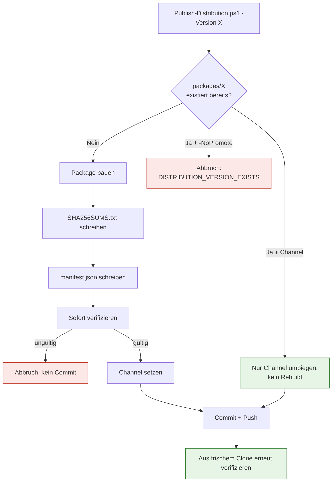
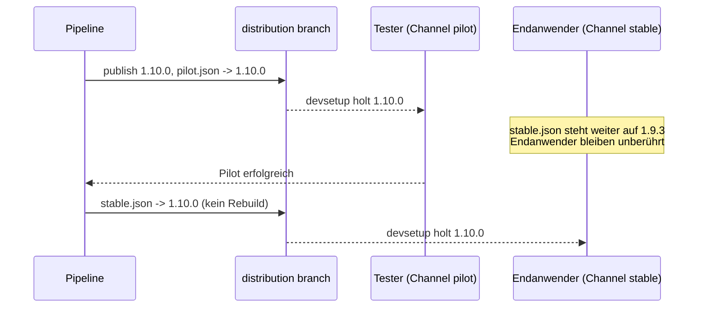

# Distributions-Architektur

**Zielgruppe:** Developer, CI/Admin
**Module:** `Distribution.psm1`, `build/Publish-Distribution.ps1`

## Ein Repository, zwei Branches

Es gibt **kein** zweites Repository. Releases liegen auf einem Orphan-Branch
desselben Repos, der keine gemeinsame History mit `main` hat.



Der Client klont **nur** den Distribution-Branch, flach. Er lädt nie den
Quellcode, nie die Tests, nie die History. Entwickler-Clones von `main`
enthalten umgekehrt nie Release-Stände.

## Warum keine ZIP

| | ZIP | Lose Dateien |
|---|---|---|
| Integrität | eine Prüfsumme über alles | Prüfsumme **pro Datei** |
| Git-Kompression | keine Delta-Kompression, jede Version kostet die volle Größe – dauerhaft | Delta-komprimiert, kaum Zuwachs bei kleinen Änderungen |
| Review | „Was hat sich geändert?" nicht beantwortbar | normaler `git diff` |
| Zusätzliche Schritte | packen + entpacken | keine |

Git ist bereits ein content-addressed, unveränderlicher Transport. Eine ZIP
darüberzulegen bringt keine Garantie hinzu und kostet Repo-Größe und
Nachvollziehbarkeit.

## Vertrauenskette



Jede Stufe wird geprüft, **bevor** der nächsten vertraut wird. Das Manifest
pinnt den Hash der Prüfsummenliste — eine manipulierte Liste fliegt auf, bevor
auch nur ein Datei-Hash geglaubt wird.

## Package-Format

```
packages/1.9.0/
├── manifest.json      Metadaten + Hash von SHA256SUMS.txt
├── SHA256SUMS.txt     "<sha256>␣␣<pfad>" je Datei, sortiert, /-Trenner
└── content/
    ├── PythonVenvAutomation/
    └── scripts4PythonAutomation/
```

`manifest.json`:

```json
{
  "schemaVersion": 1,
  "product": "DevSetup",
  "version": "1.9.0",
  "contentPath": "content",
  "checksums": "SHA256SUMS.txt",
  "checksumsSha256": "4ad4bcdff277...",
  "fileCount": 77,
  "channel": "stable",
  "minimumBootstrapVersion": "1.0.0",
  "publishedUtc": "2026-09-06T19:30:00Z"
}
```

`channels/stable.json`:

```json
{
  "schemaVersion": 1,
  "product": "DevSetup",
  "channel": "stable",
  "version": "1.9.0",
  "manifest": "packages/1.9.0/manifest.json",
  "minimumSupportedVersion": "1.7.0",
  "force": false,
  "publishedUtc": "2026-09-06T19:30:00Z"
}
```

`force = true` bedeutet: diese Version ist verpflichtend. Ein Offline-Client
darf dann **nicht** auf eine ältere lokale Version zurückfallen.

## Manifest-Validierung

Pflichtfelder und Datentypen werden strikt geprüft; **unbekannte zukünftige
Felder werden toleriert**, damit ein neuerer Publisher Daten ergänzen kann,
ohne ältere Clients zu brechen.

Eine Besonderheit: `ConvertFrom-Json` wandelt ISO-8601-Strings selbstständig in
`[datetime]` um. `publishedUtc` wird deshalb als *Timestamp* validiert, der
beide Formen akzeptiert.

## Immutability



Eine veröffentlichte Version wird **nie** überschrieben. Fixes bekommen eine
neue SemVer-Version. Der Guard sitzt in `New-DevSetupPackage`, greift also
auch bei manuellen Aufrufen.

## Channels: pilot und stable

Promotion ist reines Umbiegen einer Datei — das Package existiert bereits und
ist unveränderlich.



`Set-DevSetupChannel` verifiziert das Ziel-Package vollständig, bevor der
Channel umgebogen wird. Ein Channel kann daher nie auf eine fehlende oder
beschädigte Version zeigen.

## Berechtigungen im Azure Repo

| Gruppe | Recht |
|---|---|
| Users | Read |
| Developers | Read |
| Build Service (`<Projekt> Build Service (<Org>)`) | Read + **Contribute** |

Der Push der Pipeline läuft über `persistCredentials: true`, also über die
Build-Service-Identität. Es steht **kein PAT** im YAML.

Der `distribution`-Branch ist im Trigger **ausgeschlossen** — sonst würde jeder
Release-Push die Pipeline erneut starten.

## Siehe auch

- [Self-Update](SELF_UPDATE.md) — was der Client bei jedem Start tut
- [Azure DevOps Distribution](AZURE_DEVOPS_DISTRIBUTION.md) — Pipeline und Betrieb
