# Modul-Architektur und Ladereihenfolge

**Zielgruppe:** Developer

## Warum das wichtig ist

`Setup-Core.psm1` lädt 24 SetupCore-Module. Jedes Modul importiert zusätzlich
seine eigenen Abhängigkeiten — das ist gewollt, damit ein Modul auch einzeln
testbar bleibt.

Diese Nested Imports benutzten früher `-Force` **ohne** `-Global`. In PowerShell
*verschiebt* `-Force` ein bereits global geladenes Modul in den privaten
Session-State des importierenden Moduls. Jeder solche Import hat also eine
Abhängigkeit „ent-globalisiert".

```mermaid
flowchart TD
    subgraph bad["Vorher: -Force ohne -Global"]
        A1[Setup-Core lädt Constants -Global]:::ok
        A2[... 10 weitere Module ...]
        A3["Filesystem.psm1 importiert<br/>Constants.psm1 -Force<br/>(ohne -Global)"]:::err
        A4["Constants wandert in den<br/>privaten State von Filesystem"]:::err
        A5["Global: Get-SetupConstants weg"]:::err
        A6["Pipeline stirbt bei METADATA:<br/>'Get-ProjectMetadata is not recognized'"]:::err
        A1 --> A2 --> A3 --> A4 --> A5 --> A6
    end

    subgraph good["Nachher: -Force -Global"]
        B1[Setup-Core lädt alle Module -Global]:::ok
        B2[Nested Imports ebenfalls -Global]:::ok
        B3["Alle 24 Module bleiben global<br/>Ein Import-Module reicht"]:::ok
        B1 --> B2 --> B3
    end

    classDef ok fill:#e6f5e6,stroke:#2d7a2d
    classDef err fill:#fde8e8,stroke:#c0392b
```

Ein Nebeneffekt war schwerer zu sehen: es entstanden **zwei Instanzen desselben
Moduls mit getrennten Caches**. `Clear-SetupConfigCache` im globalen Scope
leerte dann einen anderen Cache als den, den `Detection` tatsächlich benutzte.

**Regel:** jeder Nested Import in `SetupCore/modules/*.psm1` benutzt
`-Force -DisableNameChecking -Global -ErrorAction Stop`.

## Ladereihenfolge

```mermaid
flowchart LR
    subgraph L0["Blätter (keine Abhängigkeiten)"]
        Compat
        Constants
        Errors
    end
    subgraph L1["Basis"]
        Logging
        UI
        Path
        Versioning
    end
    subgraph L2["Parsing / Prozesse"]
        Toml
        TomlParser
        NativeCommand
        Config
    end
    subgraph L3["Domäne"]
        Detection
        Filesystem
        PythonDiscovery
        Venv
        VSCode
        Tcl
        Poetry
        UV
        PackageManager
    end
    subgraph L4["Querschnitt"]
        Redaction
        SupportCodes
        PyProjectHealth
        Diagnostics
    end
    subgraph L5["Orchestrierung"]
        Prechecks
        CodeSigning
        GitSync
        SetupPipeline
        SetupSteps
    end

    L0 --> L1 --> L2 --> L3 --> L4 --> L5
```

## Trennung der Verantwortlichkeiten

| Modul | Verantwortung | Kennt **nicht** |
|---|---|---|
| `Constants` | zentrale Konstanten | alles andere |
| `Errors` | `SetupException`, Wrapping | Domänenlogik |
| `TomlParser` | TOML lesen | pyproject-Semantik |
| `Toml` | pyproject-Signale, PM-Erkennung | Venv, Signierung |
| `Detection` | PM-Entscheidung | wie installiert wird |
| `PyProjectHealth` | Findings und Healing | Venv, Git, Signierung |
| `Redaction` | Secrets entfernen | wo sie herkommen |
| `SupportCodes` | Benutzertexte | Ursachen |
| `Diagnostics` | doctor/repair/support | wie repariert wird (delegiert) |
| `SetupSteps` | einzelne Pipeline-Schritte | Reihenfolge |
| `SetupPipeline` | Ausführung, Timing, Fehler | was ein Schritt tut |

## PowerShell-Fallstricke in diesem Repo

Diese Punkte haben real Bugs verursacht und sind mit Tests abgesichert:

| Fallstrick | Wirkung | Lösung |
|---|---|---|
| `-Force` ohne `-Global` in Nested Imports | Modul verschwindet aus dem globalen Scope | immer `-Global` |
| `@($genericList)` | wirft `Argument types do not match` (PS 7.5.x) | `.ToArray()` |
| `return , $collection` | Pipeline sieht **ein** Array-Objekt statt der Elemente | Sammlungen unverpackt zurückgeben |
| `@(Get-Foo)` bei `return ,$node` | 1-Element-Array, das das Array enthält | erst zuweisen, dann `@()` |
| Mandatory `[string]` / `[string[]]` | lehnt `''` und Arrays mit Leerstrings ab | `[AllowEmptyString()]` |
| `$WhatIfPreference` | wird **nicht** über Modulgrenzen vererbt | explizit `-WhatIf:$WhatIfPreference` weiterreichen |
| `Read-Host` in Fehlerpfaden | blockiert CI unendlich | `Test-SetupInteractive` |
