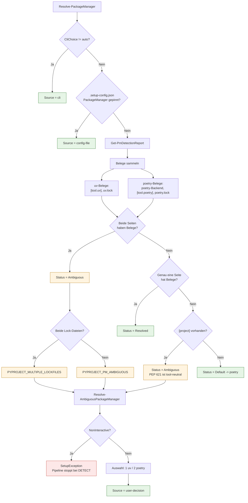

# Package Manager Detection

**Zielgruppe:** Developer, Support
**Modul:** `scripts4PythonAutomation/SetupCore/modules/Detection.psm1`, `Toml.psm1`

## Grundregel

PEP 621 `[project]` ist **tool-neutral**. Die Anwesenheit von `[project]` sagt
nichts darüber aus, ob ein Projekt mit uv oder mit Poetry verwaltet wird.
Deshalb entscheidet DevSetup ausschließlich anhand *starker* Signale und
verweigert eine Antwort, wenn die Belege widersprüchlich oder nicht vorhanden
sind.

| Manager | Starke Signale |
|---|---|
| uv | `[tool.uv]` / `[tool.uv.*]`, `uv.lock` |
| Poetry | `build-backend = "poetry.core.masonry.api"`, `[tool.poetry]` / `[tool.poetry.*]`, `poetry.lock` |

`LastWriteTime` der Lock-Dateien wird **nicht** als Tie-Breaker benutzt. Welche
Datei zuletzt geschrieben wurde, ist ein Artefakt der Werkzeugreihenfolge und
keine Aussage über die Absicht des Teams.

## Entscheidungsfluss

## Ergebnisobjekt

`Get-PmDetectionReport` liefert:

| Feld | Bedeutung |
|---|---|
| `PackageManager` | `uv`, `poetry` oder `$null` bei `Ambiguous` |
| `Status` | `Resolved` \| `Ambiguous` \| `Default` |
| `AmbiguityCode` | `PYPROJECT_PM_AMBIGUOUS` \| `PYPROJECT_MULTIPLE_LOCKFILES` \| `$null` |
| `Candidates` | Noch mögliche Manager bei `Ambiguous` |
| `Reason` | Klartextbegründung, die auch im Log erscheint |
| `HasUvSection`, `HasPoetrySection`, `HasPoetryBackend`, `HasProjectSection`, `HasUvLock`, `HasPoetryLock` | Rohsignale |

## Verhalten in CI

Nicht-interaktiv (`-NonInteractive`, `CI=1`, `TF_BUILD=1`) ist Mehrdeutigkeit
ein harter Fehler mit Support-Code **DS-P204**. Das ist Absicht: ein Build, der
selbst rät, produziert irgendwann eine falsche `.venv`.

## Auflösen einer Mehrdeutigkeit

1. `[tool.uv]` oder `[tool.poetry]` in `pyproject.toml` ergänzen — der saubere Weg.
2. Die nicht benutzte Lock-Datei löschen.
3. Einmalig pinnen: `devsetup -- -PackageManager uv` (schreibt `.setup-config.json`).

## Siehe auch

- [PyProject Health und Healing](PYPROJECT_HEALING.md)
- [devsetup doctor](DEVSETUP_DOCTOR.md)
