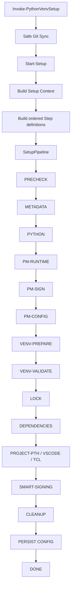

# Phase 2 - Architecture and Maintainability Refactoring

## Status

Phase 2 is implemented on the refactoring branch. `Start-Setup` now builds and executes named setup steps rather than containing the full setup implementation inline.

The public compatibility contract remains:

```text
devsetup
Invoke-PythonVenvSetup
scripts4PythonAutomation\setup-core.ps1
```

## Architecture



## `Constants.psm1`

Central source for setup constants that were previously scattered through modules. Current groups include:

```text
ConfigFileName
PackageManagers
Git.*
Network.*
Input.*
CodeSigning.*
Retry.*
```

Examples include the Git fetch timeout, DigiCert default path, input-length limits, venv deletion retry budget, cleanup retry budget, and network-probe timeout.

Consumers use:

```powershell
$constants = Get-SetupConstants
```

`Get-SetupConstants` returns a defensive deep copy so one caller cannot alter defaults for another setup run.

## `Errors.psm1`

Defines `SetupException`:

```text
SetupException
├── Message
├── ErrorCode
├── Step
└── Context
```

Arbitrary exceptions are normalized through `ConvertTo-SetupException`. The pipeline preserves the original exception as `InnerException` while exposing a stable error code and step identifier for CI/CD.

Representative codes include:

```text
DIGICERT_NOT_FOUND
PRECHECK_FAILED
PM_DETECTION_FAILED
PYTHON_RESOLUTION_FAILED
PM_RUNTIME_FAILED
PM_SIGNING_FAILED
VENV_PREPARE_FAILED
DEPENDENCY_INSTALL_FAILED
VENV_SIGNING_FAILED
VENV_UPDATE_FAILED
```

## `SetupPipeline.psm1`

Provides:

```text
New-SetupPipelineStep
Invoke-SetupPipelineStep
Invoke-SetupPipeline
```

The pipeline layer owns:

- ordered execution;
- per-step timing;
- mandatory vs optional failure behavior;
- dry-run skip behavior;
- conversion to `SetupException`;
- structured logging callbacks.

Example:

```powershell
$step = New-SetupPipelineStep `
    -Name 'DEPENDENCIES' `
    -Module 'PackageManager' `
    -Message 'Install/update project dependencies' `
    -ErrorCode 'DEPENDENCY_INSTALL_FAILED' `
    -Action {
        Invoke-DependencyInstallStep -Ctx $ctx
    }
```

## `SetupSteps.psm1`

The former `Start-Setup` blocks now live in named functions, including:

```text
New-SetupContext
Invoke-PackageManagerDetectionStep
Invoke-PrecheckStep
Invoke-ProjectMetadataStep
Invoke-PythonDetectionStep
Invoke-PackageManagerRuntimeStep
Invoke-PackageManagerSigningStep
Invoke-PackageManagerConfigureStep
Invoke-PackageManagerCleanupStep
Invoke-VenvBackupStep
Invoke-VenvPrepareStep
Invoke-VenvValidationStep
Invoke-VenvRuntimeCopyStep
Invoke-LockSyncStep
Invoke-DependencyInstallStep
Invoke-VenvPathStep
Invoke-ProjectPthStep
Invoke-VSCodeStep
Invoke-TclStep
Invoke-SmartSigningStep
Invoke-StaleCleanupStep
Invoke-VenvBackupCleanupStep
Invoke-ExistingVenvUpdateStep
```

Mutating step functions support PowerShell `ShouldProcess`, so direct module use remains compatible with `-WhatIf` and `-Confirm`, not only execution through `Start-Setup`.

## Venv and filesystem safety

The lower-level venv/filesystem helpers were also hardened. Destructive or mutating operations such as recursive deletion, process termination, backup/restore, `.pth` writes, DLL copies, quarantine moves, and stale cleanup support `ShouldProcess`.

Retry numbers and delays are no longer embedded at call sites. They are resolved from `Constants.psm1`.

## Parameter validation

Critical boundaries use PowerShell validation attributes where applicable:

```powershell
[ValidateNotNullOrEmpty()]
[ValidateSet(...)]
[ValidateRange(...)]
[ValidateScript(...)]
```

Project roots are validated before setup mutation begins. Package-manager choices, setup mode, logging level, timeout ranges, and user-input lengths are constrained at their respective boundaries.

## Dry-run semantics

Read-only steps such as package-manager detection, metadata parsing, and precheck reporting may execute during dry-run.

Steps that can mutate state are skipped. Python resolution is intentionally classified as mutation-capable because it may install Python when `AllowPythonInstall` is enabled.

`Start-Setup -WhatIf` therefore behaves as a mutation-safe preview rather than merely suppressing a subset of file writes.

## Compatibility

The refactor preserves the caller-facing command surface and legacy wrapper. Behavior changes are limited to documented safety fixes, including:

- safe Git synchronization;
- fail-safe config persistence;
- explicit DigiCert validation;
- intelligent/idempotent signing;
- structured error reporting;
- `ShouldProcess` support.

## Tests

Architecture and behavior are covered by focused Pester files for:

- constants and defensive copies;
- `SetupException` metadata and inner exceptions;
- pipeline ordering, dry-run and error behavior;
- Git synchronization decisions;
- config persistence failures;
- uv/Poetry detection;
- smart signing;
- structured logging;
- repository-wide PowerShell syntax.

`Run-Tests.ps1` enforces a 70% coverage gate for the refactored core logic in GitHub Actions and Azure Pipelines.

## Migration checklist

```text
[x] Constants.psm1
[x] Errors.psm1 / SetupException
[x] SetupPipeline.psm1
[x] SetupSteps.psm1
[x] Start-Setup migrated to named pipeline steps
[x] GitSync integrated before setup
[x] parameter boundary validation
[x] mutating setup steps support ShouldProcess
[x] venv/filesystem retry constants centralized
[x] stable per-step error codes
[x] architecture/Pester tests
[x] documentation updated
```
