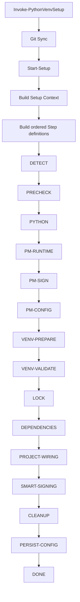

# Phase 2 - Architecture and Maintainability Refactoring

## Goal

Phase 2 turns the setup engine from a large orchestration function into a set of small, testable pipeline steps with centralized constants and structured errors.

The migration is deliberately incremental. The existing `Start-Setup` behavior remains the compatibility contract while logic is extracted into reusable modules.

---

## New architecture building blocks

### `Constants.psm1`

Central source for values that were previously scattered through modules:

```text
ConfigFileName
PackageManagers
Git.RemoteName
Git.FetchTimeoutSeconds
Git.DefaultPullStrategy
Input.MaxBooleanTextLength
CodeSigning.DefaultDigiCertUtilityExe
Retry.MaxRetry
Retry.DelayMs
```

Consumers should use:

```powershell
$constants = Get-SetupConstants
```

instead of copying literals into new modules.

---

### `Errors.psm1`

Introduces the custom exception type:

```text
SetupException
├── Message
├── ErrorCode
├── Step
└── Context
```

Example:

```powershell
throw (New-SetupException `
    -Message 'Compatible Python was not found.' `
    -ErrorCode 'PYTHON_NOT_FOUND' `
    -Step 'PYTHON' `
    -Context @{ ProjectRoot = $ctx.ProjectRoot })
```

Arbitrary PowerShell/native errors can be normalized with:

```powershell
ConvertTo-SetupException
```

This provides stable error codes for CI/CD without losing the original exception.

---

### `SetupPipeline.psm1`

Provides three primitives:

```text
New-SetupPipelineStep
Invoke-SetupPipelineStep
Invoke-SetupPipeline
```

A step is represented by metadata plus one action:

```powershell
$step = New-SetupPipelineStep `
    -Name 'PYTHON' `
    -Module 'PythonDiscovery' `
    -Message 'Resolve compatible Python interpreter' `
    -ReadOnly `
    -ErrorCode 'PYTHON_RESOLUTION_FAILED' `
    -Action {
        Invoke-PythonDetectionStep -Ctx $ctx
    }
```

The execution helper owns:

- timing,
- mandatory vs optional failure behavior,
- dry-run skip behavior,
- conversion to `SetupException`,
- optional logging callbacks.

---

## Target pipeline



The final `Start-Setup` should mainly do three things:

```text
1. Build context
2. Build step list
3. Execute pipeline
```

---

## Planned extraction from `Start-Setup`

The current monolithic blocks are migrated into named functions in this order:

| Current logic | Target function |
|---|---|
| package manager detection | `Invoke-PackageManagerDetectionStep` |
| prechecks | `Invoke-PrecheckStep` |
| pyproject parsing | `Invoke-ProjectMetadataStep` |
| Python resolution | `Invoke-PythonDetectionStep` |
| PM runtime setup | `Invoke-PackageManagerRuntimeStep` |
| PM shim signing | `Invoke-PackageManagerSigningStep` |
| venv preparation | `Invoke-VenvPreparationStep` |
| lock handling | `Invoke-LockStep` |
| dependency installation/update | `Invoke-DependencyStep` |
| `.pth` / VS Code / Tcl | `Invoke-ProjectWiringStep` |
| smart DigiCert signing | `Invoke-CodeSigningStep` |
| backup/quarantine cleanup | `Invoke-CleanupStep` |
| config persistence | `Invoke-ConfigPersistenceStep` |

This order keeps behavior stable while reducing the size of `Start-Setup` progressively.

---

## Error-code strategy

Error codes should be stable identifiers rather than raw exception messages.

Suggested families:

```text
SETUP_*
CONFIG_*
GIT_*
PYTHON_*
PM_*
VENV_*
SIGNING_*
FILESYSTEM_*
```

Examples:

```text
SETUP_PLATFORM_UNSUPPORTED
CONFIG_WRITE_FAILED
GIT_FETCH_TIMEOUT
PYTHON_NOT_FOUND
PM_RUNTIME_FAILED
VENV_CREATE_FAILED
SIGNING_FAILED
```

Console output can remain human-readable while CI/CD can key off `ErrorCode`.

---

## Parameter validation policy

Critical public/internal parameters should use PowerShell validation attributes where possible:

```powershell
[ValidateNotNullOrEmpty()]
[ValidateSet(...)]
[ValidateRange(...)]
[ValidateScript(...)]
```

Example for project roots:

```powershell
[ValidateScript({
    if (-not (Test-Path -LiteralPath $_ -PathType Container)) {
        throw "Directory does not exist: $_"
    }
    $true
})]
[string] $ProjectRoot
```

Validation should happen at the boundary, before mutation starts.

---

## Compatibility rule

Phase 2 must not change the normal caller contract:

```powershell
devsetup
Invoke-PythonVenvSetup
.\scripts4PythonAutomation\setup-core.ps1
```

Existing arguments remain valid. Internal architecture may change, but observable behavior should only change when fixing a defect or making an explicitly documented safety improvement.

---

## Tests

`tests/Architecture.Tests.ps1` covers the Phase 2 primitives:

- centralized constants,
- defensive copies of constants,
- structured exception metadata,
- preservation of inner exceptions,
- ordered pipeline execution,
- dry-run behavior,
- mandatory failure behavior,
- optional failure continuation.

As each old `Start-Setup` block is extracted, its behavior should receive focused unit tests before the old inline block is removed.

---

## Migration status

Implemented:

```text
[x] Constants.psm1
[x] Errors.psm1 / SetupException
[x] SetupPipeline.psm1
[x] Architecture.Tests.ps1
[x] Phase 2 architecture documentation
```

Next migration slice:

```text
[ ] import new Phase 2 modules from Setup-Core.psm1
[ ] replace legacy Invoke-SetupStep internals with SetupPipeline primitive
[ ] extract DETECT / PRECHECK / PYTHON steps
[ ] add stable error codes to those steps
[ ] add parameter boundary validation
```

The remaining setup steps can then be migrated in smaller reviewed commits instead of one high-risk rewrite.
