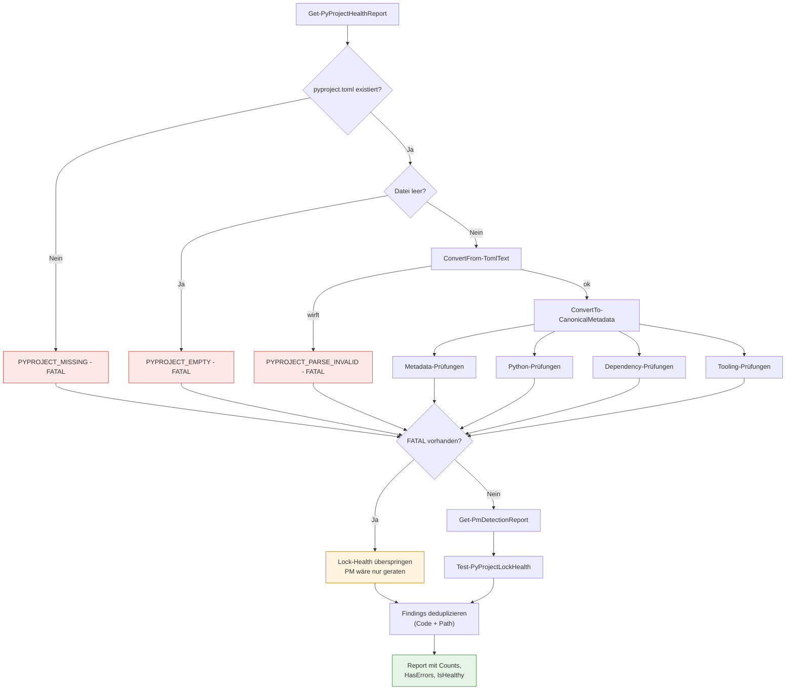
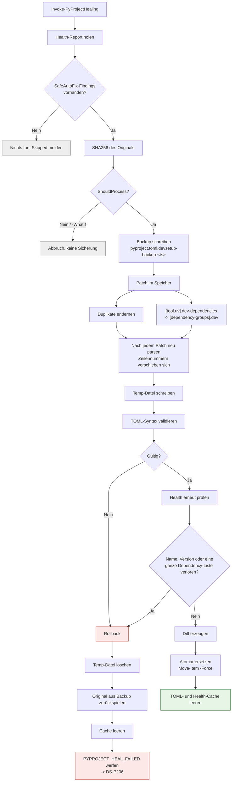

# PyProject Health und Healing

**Zielgruppe:** Developer, Support
**Module:** `PyProjectHealth.psm1`, `TomlParser.psm1`

## Zwei getrennte Vorgänge

| | `Get-PyProjectHealthReport` | `Invoke-PyProjectHealing` |
|---|---|---|
| Schreibt? | nie | nur SafeAutoFix-Findings |
| Benutzt von | `devsetup doctor` | `devsetup repair` |
| Lock-Dateien | nur bewerten | **nie** anfassen |

## Finding-Modell

Jedes Finding trägt:

```
Code            PYPROJECT_DUPLICATE_DEPENDENCY
Severity        INFO | WARN | ERROR | FATAL
Message         Klartext für den Benutzer
AutoFixable     $true nur bei FixClass = SafeAutoFix
FixClass        SafeAutoFix | NeedsDecision | NotFixable
CurrentValue    was gefunden wurde
SuggestedValue  was stattdessen gelten sollte
Path            Datei oder TOML-Pfad
Category        file | syntax | metadata | python | dependencies | tooling | packagemanager | lock
```

## Health-Codes

| Code | Severity | FixClass |
|---|---|---|
| `PYPROJECT_MISSING` | FATAL | NeedsDecision |
| `PYPROJECT_EMPTY` | FATAL | NeedsDecision |
| `PYPROJECT_PARSE_INVALID` | FATAL | NotFixable |
| `PYPROJECT_NAME_MISSING` | ERROR | NeedsDecision |
| `PYPROJECT_VERSION_MISSING` | WARN | NeedsDecision |
| `PYPROJECT_REQUIRES_PYTHON_MISSING` | ERROR | NeedsDecision |
| `PYPROJECT_PYTHON_CONSTRAINT_INVALID` | ERROR | NeedsDecision |
| `PYPROJECT_PYTHON_CONSTRAINT_CONFLICT` | ERROR | NeedsDecision |
| `PYPROJECT_PM_AMBIGUOUS` | ERROR | NeedsDecision |
| `PYPROJECT_MULTIPLE_LOCKFILES` | ERROR | NeedsDecision |
| `PYPROJECT_DUPLICATE_DEPENDENCY` | WARN | **SafeAutoFix** |
| `PYPROJECT_METADATA_DIVERGED` | ERROR | NeedsDecision |
| `PYPROJECT_UV_SOURCE_ORPHANED` | WARN | NeedsDecision |
| `PYPROJECT_LEGACY_UV_DEV_DEPENDENCIES` | WARN | **SafeAutoFix** * |
| `PYPROJECT_POETRY_METADATA_LEGACY` | WARN | NeedsDecision |
| `LOCK_MISSING` | WARN | SafeAutoFix |
| `LOCK_OUTDATED` | WARN | SafeAutoFix |
| `LOCK_INVALID` | ERROR | NeedsDecision |
| `LOCK_WRONG_MANAGER` | ERROR | NeedsDecision |

\* wird zu **NeedsDecision** hochgestuft, wenn Dev-Dependencies gleichzeitig in
`[tool.uv].dev-dependencies` **und** `[dependency-groups].dev` stehen — dann ist
nicht entscheidbar, welche Liste gilt.

## Analysefluss



## Transaktionales Healing



**Es bleibt nie ein halb reparierter Zustand zurück.** Schlägt ein Schritt nach
dem Backup fehl, wird das Original zurückgespielt und geworfen.

## Sicherheitsnetz gegen zerstörerische Patches

Vor dem atomaren Ersetzen wird das kanonische Modell vorher/nachher verglichen.
Ein Patch wird zurückgerollt, wenn er

- den Projektnamen entfernt,
- die Projektversion entfernt,
- die komplette Runtime-Dependency-Liste leert oder
- die komplette Dev-Dependency-Liste leert.

## TOML-Parser

`TomlParser.psm1` ist ein bewusster **Teilmengen**-Parser für das, was echte
`pyproject.toml`-Dateien benutzen: Table-Header, Array-of-Tables, dotted und
quoted Keys, Basic/Literal/Multi-Line-Strings, Zahlen, Booleans, Arrays
(auch mehrzeilig mit Kommentaren) und Inline-Tables.

Er ist **fail-closed**: was er nicht sicher versteht, führt zu
`TOML_PARSE_ERROR`. Ein Healing-Lauf arbeitet nie auf einem nur halb
verstandenen Dokument. Datums-/Zeitwerte werden explizit abgelehnt.

Zusätzlich merkt er sich pro Key die Start- und Endzeile des Werts, damit der
Patch-Layer exakt die richtigen Zeilen ersetzt — statt globaler
Regex-Ersetzungen.

## Kommentare und Formatierung

Der Patch-Layer erhält Einrückung, Anführungszeichenstil, Zeilenumbrüche und
die Array-Form: ein einzeiliges Array bleibt einzeilig, ein mehrzeiliges bleibt
mehrzeilig.
