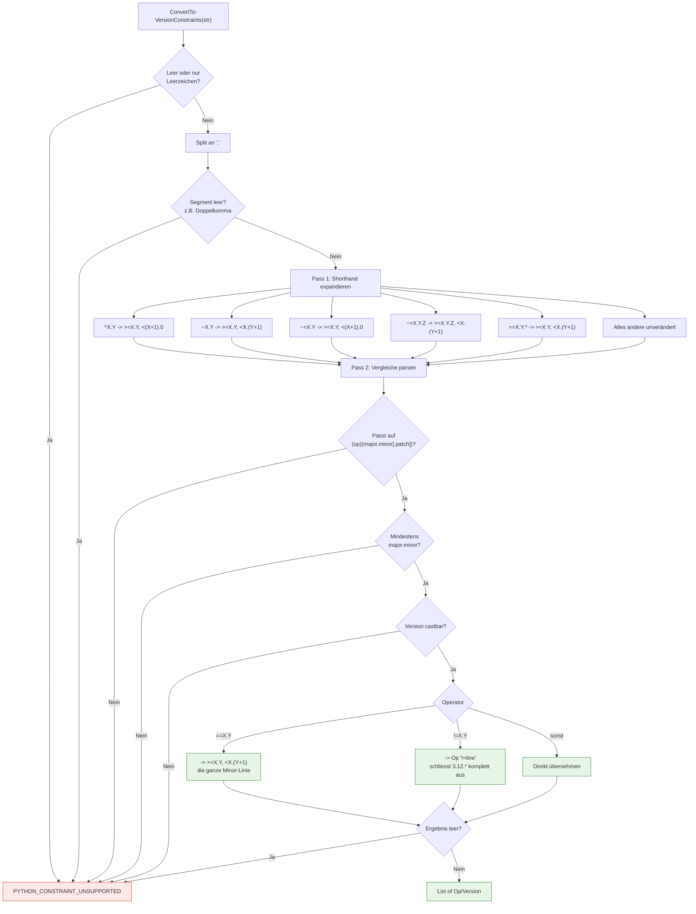

# Python Version Constraints

**Zielgruppe:** Developer
**Modul:** `scripts4PythonAutomation/SetupCore/modules/Versioning.psm1`

## Grundregel: fail closed

`ConvertTo-VersionConstraints` überspringt **nichts** stillschweigend. Wenn ein
Constraint nicht vollständig und eindeutig interpretiert werden kann, wird
`PYTHON_CONSTRAINT_UNSUPPORTED` geworfen.

Vorher wurde ein unverstandener Token mit einer Warnung verworfen. Aus
`>=3.11,@@@` wurde dadurch effektiv `>=3.11` — die Anforderung des Projekts
wurde also stillschweigend abgeschwächt und DevSetup konnte eine Python-Version
auswählen, die das Projekt gar nicht unterstützt.

## Parsing-Fluss

## Unterstützte Syntax

| Eingabe | Ergebnis |
|---|---|
| `>=3.11,<3.13` | `>=3.11` `<3.13` |
| `>=3.11` | `>=3.11` |
| `==3.11` | `>=3.11` `<3.12` (die 3.11-Linie, nicht exakt 3.11.0) |
| `==3.11.4` | exakt `3.11.4` |
| `==3.11.*` | `>=3.11` `<3.12` |
| `^3.11` | `>=3.11` `<4.0` |
| `^0.5` | `>=0.5` `<0.6` |
| `~3.11` | `>=3.11` `<3.12` |
| `~=3.11` | `>=3.11` `<4.0` |
| `~=3.11.4` | `>=3.11.4` `<3.12` |
| `!=3.12` | schließt **jede** 3.12.x aus |
| `!=3.12.1` | schließt genau 3.12.1 aus |
| `3.11` | wie `==3.11` |

## Abgelehnte Syntax

`~=3` · `>=3` · `>=abc` · `foo` · `>=3.11 <3.13` (fehlendes Komma) ·
`>=3.11,,<3.13` · `>=3.11,` · `===3.11` · `3.11.*.*` · `>=3.11.x`

Jeder dieser Fälle liefert `PYTHON_CONSTRAINT_UNSUPPORTED`, was auf den
Support-Code **DS-P202** abgebildet wird.

## `!=` schließt die ganze Minor-Linie aus

`!=3.12` bedeutet in der Praxis „diese Python-Linie funktioniert nicht", nicht
„exakt 3.12.0 funktioniert nicht". Deshalb erzeugt der Parser den internen
Operator `!=line`:

| Version | `>=3.11,!=3.12` |
|---|---|
| 3.11.9 | erfüllt |
| 3.12.0 | **nicht** erfüllt |
| 3.12.5 | **nicht** erfüllt |
| 3.13.1 | erfüllt |

`Test-VersionConstraints` wirft bei einem unbekannten Operator ebenfalls, statt
ihn als „erfüllt" durchzuwinken.
