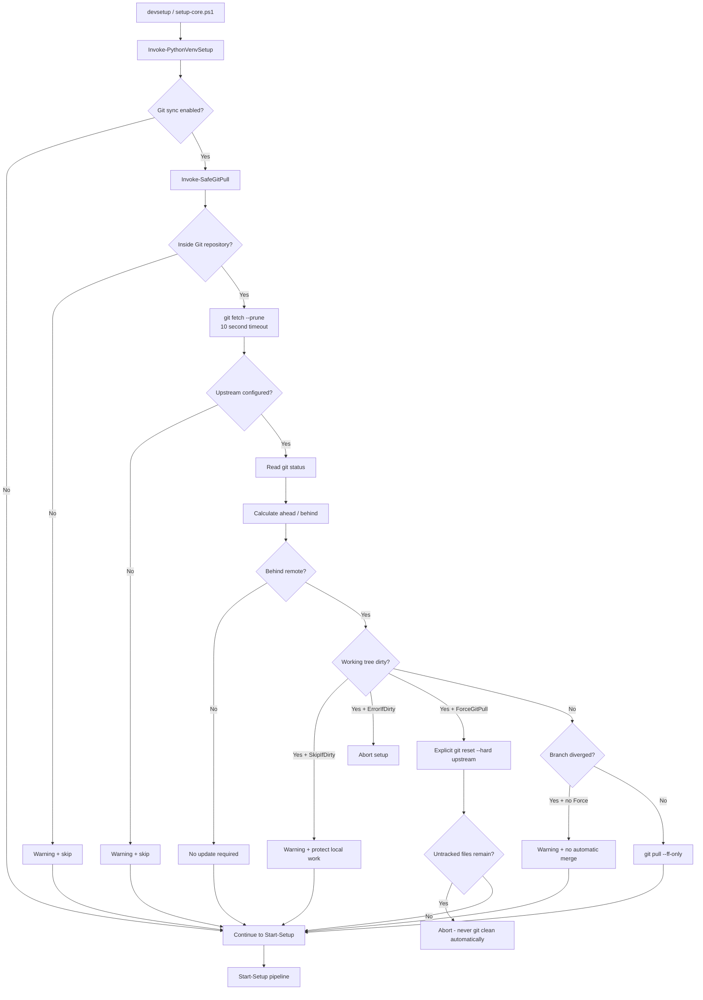

# Safe Git Synchronization before Python environment setup

## Status

Implemented in branch:

```text
refactor/phase1-safe-git-sync
```

This document describes the Phase 1 Git synchronization behavior that runs before the Python environment setup pipeline.

The implementation consists of:

- `scripts4PythonAutomation/SetupCore/modules/GitSync.psm1`
- `PythonVenvAutomation/Public/Invoke-PythonVenvSetup.ps1`
- `scripts4PythonAutomation/setup-core.ps1`

The design goal is simple: update a project repository before environment setup **without silently destroying local work or creating merge commits**.

---

## Why this exists

The setup tool can recreate environments, update dependency lock files, install packages, write editor settings, and sign executables. Running those operations against an outdated checkout can produce inconsistent results.

A naive `git pull` at the start of setup is unsafe because it may:

- create merge commits,
- fail in the middle of setup,
- interact badly with local modifications,
- overwrite tracked changes if combined with an unsafe reset,
- leave the repository in a conflict state.

The Git synchronization step therefore uses a conservative, fail-safe policy.

---

## High-level process



---

## Security invariants

The implementation follows these rules.

### 1. No automatic merge commits

Normal synchronization uses:

```powershell
git pull --ff-only
```

If a branch has diverged, the tool does not create a merge commit automatically.

Example:

```text
          C---D  local
         /
A---B---X
         \
          E---F  remote
```

Without explicit force, the result is:

```text
GitSync: Diverged
Automatic merge: disabled
Setup: continues without modifying Git state
```

The operator must resolve the branch state manually.

---

### 2. Dirty working trees are protected by default

Default behavior:

```json
{
  "AutoGitPull": true,
  "GitPullStrategy": "SkipIfDirty"
}
```

If the remote is ahead while local files are modified:

```text
remote:  A---B---C
local:   A---B
              + modified pyproject.toml
```

Git synchronization returns:

```text
SkippedDirty
```

No tracked files are overwritten.

---

### 3. Destructive reset requires an explicit CLI flag

A hard reset is only allowed when the caller explicitly supplies:

```powershell
-ForceGitPull
```

Example:

```powershell
Invoke-PythonVenvSetup -ForceGitPull -Confirm
```

or through the legacy wrapper:

```powershell
.\scripts4PythonAutomation\setup-core.ps1 -ForceGitPull -Confirm
```

This capability is intentionally **not configurable through `.setup-config.json`**.

The following configuration is therefore not supported:

```json
{
  "ForceGitPull": true
}
```

This prevents a repository-controlled config file from silently enabling destructive Git operations on a developer machine.

---

### 4. Untracked files are never automatically deleted

Even during an explicit forced reset, the module does **not** run:

```powershell
git clean -fd
```

`git reset --hard` only affects tracked state. After the reset, GitSync checks the repository again.

If untracked or outstanding files remain, setup stops with an error rather than deleting them.

---

### 5. Fetch is bounded by a timeout

Remote communication is executed with a default timeout of 10 seconds:

```text
TimeoutSeconds = 10
```

This avoids hanging the entire setup process indefinitely because of an unavailable Git remote, VPN problem, credential prompt, or broken network connection.

---

### 6. Git mutations support `ShouldProcess`

`Invoke-SafeGitPull` is implemented with:

```powershell
[CmdletBinding(SupportsShouldProcess = $true, ConfirmImpact = 'Medium')]
```

Mutating operations are guarded by `$PSCmdlet.ShouldProcess(...)`.

This provides standard PowerShell support for:

```powershell
-WhatIf
-Confirm
```

Example:

```powershell
Invoke-SafeGitPull -RepositoryPath C:\src\project -WhatIf
```

A dry setup run forwards this behavior to GitSync:

```powershell
Invoke-PythonVenvSetup -DryRun
```

In dry-run mode, remote-tracking references are not intentionally modified by GitSync; the decision is based on the locally cached Git references.

---

## Configuration

The repository already uses:

```text
.setup-config.json
```

The implementation deliberately keeps that existing filename instead of introducing a second `.setup.config.json` file.

### Supported Git configuration keys

```json
{
  "AutoGitPull": true,
  "GitPullStrategy": "SkipIfDirty"
}
```

### `AutoGitPull`

Type:

```text
JSON boolean
```

Allowed values:

```json
true
false
```

Default:

```json
true
```

Invalid example:

```json
{
  "AutoGitPull": "true"
}
```

Strings are rejected because configuration parsing is strict.

---

### `GitPullStrategy`

Allowed values:

```text
SkipIfDirty
ErrorIfDirty
```

#### `SkipIfDirty`

Default and recommended developer behavior.

```text
Dirty repository + remote ahead
            |
            v
       Warning only
            |
            v
      Git pull skipped
```

The Python setup may continue using the current local checkout.

#### `ErrorIfDirty`

Recommended for controlled automation where a dirty checkout indicates a pipeline problem.

```text
Dirty repository + remote ahead
            |
            v
          Error
            |
            v
       Setup aborted
```

---

## CLI options

### Normal safe synchronization

```powershell
Invoke-PythonVenvSetup
```

Effective defaults:

```text
AutoGitPull      = true
GitPullStrategy  = SkipIfDirty
ForceGitPull     = false
```

---

### Skip Git synchronization for one run

```powershell
Invoke-PythonVenvSetup -SkipGitPull
```

Legacy wrapper:

```powershell
.\scripts4PythonAutomation\setup-core.ps1 -SkipGitPull
```

`-SkipGitPull` overrides `AutoGitPull = true` for that invocation.

---

### Explicit forced alignment

```powershell
Invoke-PythonVenvSetup -ForceGitPull -Confirm
```

The forced path may discard:

- tracked local modifications,
- local commits that are not present in the configured upstream.

It does not delete untracked files.

Use this only when the operator intentionally wants the local checkout to match the upstream branch.

---

## Decision matrix

| Local state | Remote state | Default result | `ErrorIfDirty` | `-ForceGitPull` |
|---|---|---|---|---|
| clean | equal | no action | no action | no action |
| clean | behind | `git pull --ff-only` | `git pull --ff-only` | reset allowed, but not required |
| clean | ahead | no pull | no pull | no destructive action required |
| clean | diverged | warning, skip | warning, skip | reset to upstream |
| dirty | equal | no remote update required | no remote update required | no reset required |
| dirty | behind | warning, skip | abort | reset to upstream |
| dirty | diverged | warning, skip | abort | reset to upstream |
| untracked files after forced reset | any | n/a | n/a | abort; no `git clean` |

---

## Result object

`Invoke-SafeGitPull` returns a structured object containing:

```text
Status
RepositoryRoot
Branch
Upstream
Ahead
Behind
Dirty
Changed
Message
```

Representative status values include:

```text
NotGitRepository
DetachedHead
NoUpstream
UpToDate
Ahead
SkippedDirty
Diverged
FastForwarded
ForceReset
WhatIfFastForward
WhatIfForceReset
```

This allows later logging and CI integration without parsing console text.

---

## Integration point

The current Phase 1 implementation invokes Git synchronization from:

```text
PythonVenvAutomation/Public/Invoke-PythonVenvSetup.ps1
```

before:

```text
Start-Setup
```

Current execution flow:

```text
devsetup
   |
   v
Invoke-PythonVenvSetup
   |
   +--> read .setup-config.json
   |
   +--> Invoke-SafeGitPull
   |
   v
Start-Setup
   |
   +--> package-manager detection
   +--> prechecks
   +--> Python resolution
   +--> uv / Poetry
   +--> .venv
   +--> dependency installation
   +--> code signing
```

This integration point is intentional for Phase 1 because both the distributable module and the backward-compatible wrapper converge at `Invoke-PythonVenvSetup`.

A later architecture refactor can move the operation into the formal `Start-Setup` step collection while preserving the same safety rules.

---

## Boolean parsing hardening

As part of the same Phase 1 work, the public boolean normalization no longer uses regex matching against user input.

Old pattern:

```powershell
switch -Regex ($text) {
    '^(true|1|yes|on)$' { ... }
}
```

Current behavior uses exact normalized string comparison:

```powershell
switch ($text.ToLowerInvariant()) {
    'true'  { return $true }
    '1'     { return $true }
    'yes'   { return $true }
    'on'    { return $true }
    'false' { return $false }
    '0'     { return $false }
    'no'    { return $false }
    'off'   { return $false }
}
```

Input is additionally limited to 10 characters before comparison.

---

## Operational examples

### Safe developer default

`.setup-config.json`:

```json
{
  "PackageManager": "auto",
  "AutoGitPull": true,
  "GitPullStrategy": "SkipIfDirty"
}
```

Run:

```powershell
devsetup
```

Behavior:

```text
clean + behind   -> fast-forward
clean + current  -> no change
dirty + behind   -> warning, no Git mutation
diverged         -> warning, no automatic merge
```

---

### Strict CI checkout

`.setup-config.json`:

```json
{
  "AutoGitPull": true,
  "GitPullStrategy": "ErrorIfDirty"
}
```

Run:

```powershell
Invoke-PythonVenvSetup -NonInteractive
```

A dirty repository that also requires a remote update fails instead of silently continuing.

---

### Preview before forced synchronization

```powershell
Invoke-PythonVenvSetup -ForceGitPull -DryRun
```

or directly:

```powershell
Invoke-SafeGitPull -RepositoryPath C:\src\project -Force -WhatIf
```

This is the recommended way to inspect a potentially destructive operation before running it for real.

---

## Non-goals

GitSync deliberately does not try to solve every Git workflow.

It does not:

- rebase local commits,
- auto-stash local changes,
- create merge commits,
- resolve conflicts,
- delete untracked files,
- switch branches,
- create tracking branches,
- modify remote URLs,
- manage Git credentials.

Those operations require explicit developer intent and remain outside the environment setup automation.

---

## Security summary

The core rule is:

> Automatic setup may update a clean repository by fast-forward, but it must never silently destroy local work.

Normal path:

```text
fetch -> inspect -> fast-forward only
```

Destructive path:

```text
explicit -ForceGitPull -> ShouldProcess -> reset --hard
```

Never automatic:

```text
git clean
auto merge
auto rebase
silent conflict resolution
```
