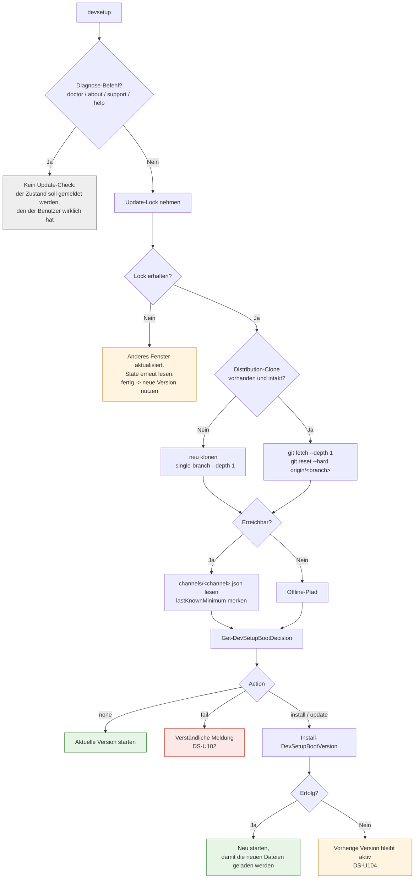
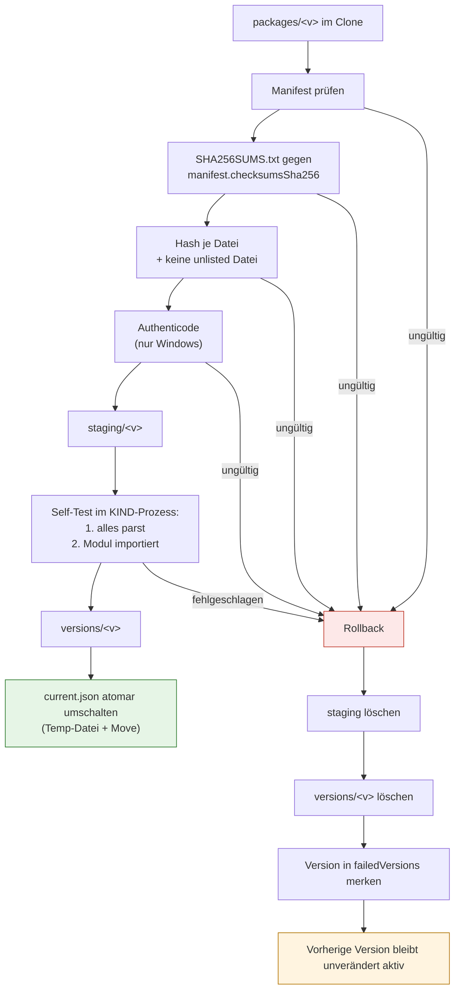
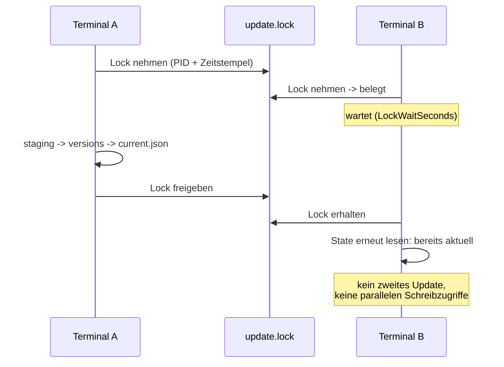

# Self-Update

**Zielgruppe:** Developer, Support
**Datei:** `PythonVenvAutomation/templates/DevSetup.Bootstrap.ps1`

## Grundregel

Der Updatecheck läuft bei **jedem** `devsetup`-Start. Es gibt bewusst keine
12h/24h-Cache-Logik. Ein Netzwerkfehler blockiert den Benutzer trotzdem nicht.

## Ablauf



## Entscheidungsmatrix

`Get-DevSetupBootDecision` ist eine reine Funktion ohne I/O — jeder Zweig ist
direkt testbar.

| Zustand | Ergebnis |
|---|---|
| installiert == Channel | `none` |
| installiert > Channel | `none` |
| installiert < Channel | `update` |
| nichts installiert | `install` |
| installiert < `minimumSupportedVersion` | `update` (nicht mehr optional) |
| Channel nennt keine Version | `fail` |
| Zielversion steht in `failedVersions` | `none` (kein Loop) |
| **offline**, installiert ≥ Minimum | `none` + Warnung |
| **offline**, installiert < Minimum | `fail` |
| **offline**, nichts installiert | `fail` |
| **offline**, `force = true` | `fail` (kein Fallback) |
| **offline**, `AllowOfflineContinue = false` | `fail` |

Der zuletzt bekannte `minimumSupportedVersion` wird als `lastKnownMinimum` im
State gespeichert. Nur dadurch kann die Untergrenze auch offline greifen.

## Atomare Aktivierung



Die aktive Installation wird **nie** direkt überschrieben. Der Self-Test läuft
in einem Kindprozess, damit ein defektes Paket die laufende Sitzung nicht
vergiften kann.

`state/current.json`:

```json
{
  "version": "1.9.0",
  "previousVersion": "1.8.3",
  "activatedUtc": "2026-09-06T19:31:02.1234567Z",
  "failedVersions": ["1.9.1"],
  "lastKnownMinimum": "1.7.0"
}
```

## Kein Update-Loop

Eine Version, die beim Aktivieren scheitert, landet in `failedVersions`.
`Get-DevSetupBootDecision` bietet sie danach nicht mehr an — der Benutzer
arbeitet auf der letzten funktionierenden Version weiter, statt bei jedem
Start denselben fehlschlagenden Versuch zu sehen. Ein späterer, korrigierter
Publish derselben Version räumt die Markierung beim erfolgreichen Aktivieren
wieder ab.

Benutzerausgabe in diesem Fall:

```
Eine neue DevSetup-Version konnte nicht gestartet werden.

Die vorherige funktionierende Version wurde automatisch wiederhergestellt.

Sie koennen weiterarbeiten.

Fehlercode: DS-U104
```

## Parallele Terminals



Ein Lock gilt als **stale**, wenn

* der eingetragene Prozess nicht mehr läuft,
* die Datei unlesbar ist (abgestürzter Schreiber), oder
* sie älter als `LockStaleMinutes` ist (PID kann wiederverwendet worden sein).

## Architektur-Grenze

Der Bootstrap kennt ausschließlich: Distribution-Repo, Channel, lokale
Versionen, Lock, Manifest-Validierung, SHA256, Authenticode, Staging,
Aktivierung, Rollback und den Start der eigentlichen Version.

Er kennt **nicht**: `pyproject.toml`, Poetry, uv, Python Discovery, `.venv`,
Dependency Management, VS Code, Tcl.

Das ist kein Vorsatz auf dem Papier: `tests/Bootstrap.Tests.ps1` scannt die
Datei und schlägt fehl, sobald einer dieser Begriffe auftaucht oder das Modul
importiert wird.

## Konfiguration

`%LOCALAPPDATA%\Company\DevSetup\config.json` — enthält nie Zugangsdaten:

| Schlüssel | Default | Bedeutung |
|---|---|---|
| `DistributionUri` | – | Clone-URL des Repos |
| `DistributionBranch` | `distribution` | Release-Branch |
| `Channel` | `stable` | `stable` oder `pilot` |
| `AutoUpdateEnabled` | `true` | Updatecheck aktiv |
| `AllowOfflineContinue` | `true` | Offline mit lokaler Version weiterarbeiten |
| `GitTimeoutSeconds` | `60` | Timeout je git-Aufruf |
| `LockWaitSeconds` | `90` | Wartezeit auf das Update-Lock |
| `LockStaleMinutes` | `15` | Alter, ab dem ein Lock als verwaist gilt |
| `KeepVersions` | `3` | behaltene Versionen (aktive und vorherige immer) |
