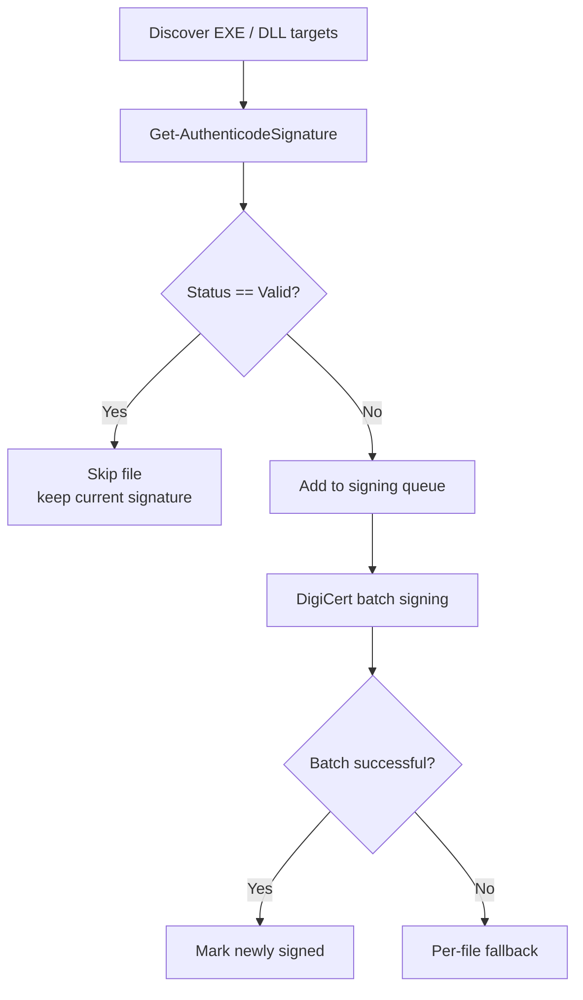

# Intelligent DigiCert signing for existing virtual environments

## Problem

Repeated setup/update runs must not re-sign every executable in an existing `.venv`.

Previously, all discovered `.exe` / `.dll` files were passed to DigiCert on every signing step, even when they already had a valid Authenticode signature.

That is unnecessary, slow, and can replace valid existing signatures.

## New behavior

Before DigiCert is invoked, every candidate is inspected with:

```powershell
Get-AuthenticodeSignature
```

Decision logic:



## What gets skipped

A file is not re-signed when Authenticode reports:

```text
Valid
```

This applies to both company signatures and valid third-party/vendor signatures.

The automation deliberately preserves an already-valid vendor signature instead of replacing it just because a setup run occurred.

## What gets signed again

Any non-valid status becomes a signing candidate, for example:

```text
NotSigned
HashMismatch
NotTrusted
UnknownError
InspectionError
```

This is especially important for changed files: if a previously signed executable is modified, its Authenticode hash no longer validates and the file automatically re-enters the signing queue.

## Result semantics

The signing result now contains:

```text
Total
Signed
NewlySigned
Skipped
SkippedFiles
Failed
Pending
ForceResign
```

`Signed` remains backward-compatible and means:

> number of targets that are in a valid signed state after the operation

Example:

```text
20 discovered files
17 already valid
3 unsigned
3 successfully signed

Total       = 20
Signed      = 20
NewlySigned = 3
Skipped     = 17
Failed      = 0
```

This allows existing setup checks such as `Signed -lt 1` to continue working even when a shim was already correctly signed and therefore did not need another DigiCert operation.

## Explicit re-sign

An operator can intentionally bypass the optimization with:

```powershell
Set-CodeSignature -Files $files -ForceResign -Confirm
```

or equivalent higher-level signing functions.

`-ForceResign` is for explicit certificate-rotation or policy scenarios; it should not be the normal setup/update behavior.

## Expected update behavior

For an existing `.venv`:

```text
Existing valid executables  -> inspect -> skip
New package executable      -> inspect -> sign
Updated executable          -> signature invalid after content change -> sign
Unsigned executable         -> sign
Invalid signature           -> sign/repair
```

The end result is an idempotent signing step: repeated runs with no binary changes perform signature checks but no DigiCert signing calls.
