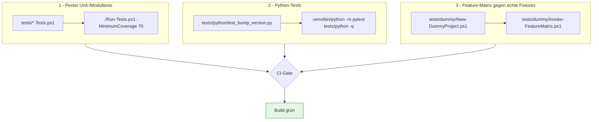
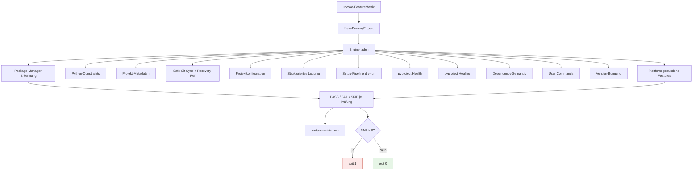

# Testen und Dummy-Workspace

**Zielgruppe:** Developer, CI/Admin

## Drei Ebenen



## Dummy-Workspace

`tests/dummy/New-DummyProject.ps1` baut einen Wegwerf-Workspace mit allen
Projektformen, die DevSetup unterscheiden muss — und mit **echten**
Git-Repositories samt echter Upstreams, damit Safe Git Sync nicht gemockt,
sondern wirklich ausgeführt wird.

### Python-Projekte

| Verzeichnis | Aufbau | Erwartung |
|---|---|---|
| `uv-project` | `[project]` + `[tool.uv]` + `uv.lock` | Resolved: uv |
| `poetry-project` | `[tool.poetry]` + Poetry-Backend + Lock | Resolved: poetry |
| `pep621-only` | nur `[project]` | Ambiguous |
| `dual-lock` | `[project]` + beide Locks | Ambiguous (MULTIPLE_LOCKFILES) |
| `both-tools` | `[tool.uv]` **und** `[tool.poetry]` | Ambiguous |
| `no-signal` | leeres Verzeichnis | Default: poetry |
| `bad-constraint` | `requires-python = ">=3.11 <3.13"` | Constraint fail-closed |
| `no-version` | `[project]` ohne `version` | VERSION_MISSING |
| `malformed` | kaputtes TOML | PARSE_INVALID |
| `diverged-meta` | `[tool.poetry].version` ≠ `[project].version` | METADATA_DIVERGED |
| `requirements-only` | nur `requirements.txt` | PYPROJECT_MISSING |

### Git-Repositories

| Verzeichnis | Zustand | Erwarteter Status |
|---|---|---|
| `clean` | synchron | `UpToDate` |
| `behind` | Upstream ist voraus | `FastForwarded` |
| `dirty-behind` | hinterher **und** lokale Änderungen | `SkippedDirty` |
| `diverged` | beide Seiten bewegt | `Diverged` |
| `no-upstream` | Branch ohne Tracking | `NoUpstream` |
| `detached` | Detached HEAD | `DetachedHead` |
| `not-a-repo` | normales Verzeichnis | `NotGitRepository` |

## Feature-Matrix

`Invoke-FeatureMatrix.ps1` fährt jedes auf diesem Host ausführbare Feature gegen
die Fixtures und druckt eine Pass/Fail-Matrix. Features, die außerhalb von
Windows wirklich nicht laufen können, erscheinen als **SKIP mit Begründung** —
nie stillschweigend weggelassen.



## Ausführen

```powershell
# Alle Pester-Tests inklusive Coverage-Gate (wie in CI)
./Run-Tests.ps1 -MinimumCoverage 70

# Dummy-Workspace erzeugen
./tests/dummy/New-DummyProject.ps1

# Feature-Matrix
./tests/dummy/Invoke-FeatureMatrix.ps1
```

Auf macOS/Linux schlagen die 5 Tests in `CodeSigning.Tests.ps1` fehl, weil sie
`Get-AuthenticodeSignature` mocken, das dort nicht existiert. Der Agent-Treiber
`.claude/skills/run-python-venv-automation/driver.ps1 test -SkipSigningTests`
schließt genau diese Datei aus.

## Nicht-interaktiv

Fehlerpfade fragen `Test-SetupInteractive`, bevor sie einen Prompt zeigen.
`DEVSETUP_NONINTERACTIVE=1` erzwingt den unbeaufsichtigten Modus; `CI`,
`TF_BUILD` und `GITHUB_ACTIONS` wirken automatisch.
