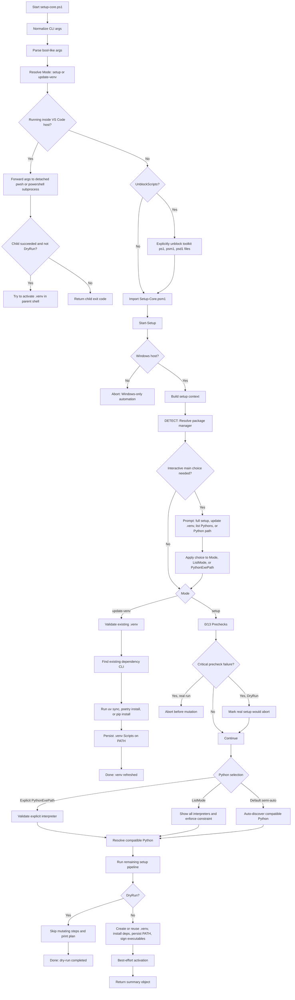
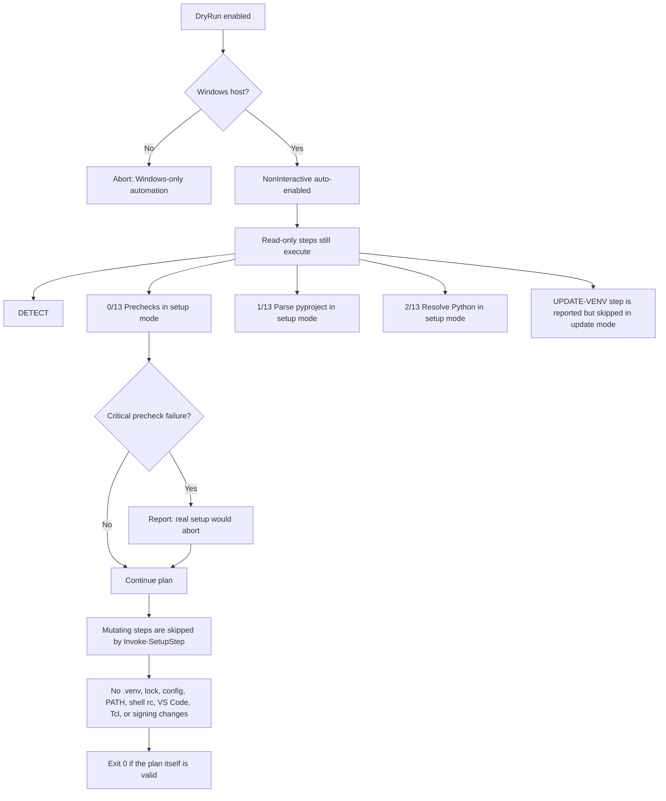

# Python Venv Automation Flowcharts

This document reflects the current `setup-core.ps1` and `Start-Setup` process.
The automation is Windows-only: `Start-Setup` aborts immediately on any
non-Windows host before detection, prechecks, or filesystem mutation.

DigiCert Utility is required infrastructure for full setup runs. On Windows, a
real setup run aborts at prechecks if DigiCert is missing. Dry-run mode reports
that abort condition and continues printing the remaining plan without mutating
files.

## Operator Flow

## Detailed Setup Pipeline

```mermaid
flowchart TD
    A[setup-core.ps1] --> A1[Capture CLI values]
    A1 --> A2[Resolve NonInteractive from flag, DryRun, or CI=true]
    A2 --> A3[Resolve bool-like options]
    A3 --> A4[Forward Mode, PackageManager, Python, and dependency flags]
    A4 --> A5{VS Code integrated host?}
    A5 -->|Yes| A6[Start detached subprocess with forwarded args]
    A5 -->|No| A7{UnblockScripts?}
    A7 -->|Yes| A8[Unblock toolkit files only]
    A7 -->|No| A9[Import root module]
    A8 --> A9
    A9 --> B[Start-Setup]

    B --> B0{Windows host?}
    B0 -->|No| B00[Throw: Windows-only automation]
    B0 -->|Yes| B1[Clear VIRTUAL_ENV, POETRY_ACTIVE, CONDA_PREFIX]
    B1 --> B2[Build mutable context]
    B2 --> C[DETECT: Invoke-PmDetection]

    C --> C1[Merge .setup-config.json pinned tool versions]
    C1 --> C2{PackageManager source}
    C2 -->|CLI uv or poetry| C3[Use explicit CLI manager]
    C2 -->|Config PackageManager| C4[Use pinned config manager]
    C2 -->|pyproject signal| C5[Detect from backend, tool sections, project table]
    C2 -->|lock files| C6[Use uv.lock or poetry.lock tiebreaker]
    C2 -->|no signal| C7[Default to poetry]
    C3 --> CP{Interactive main choice needed?}
    C4 --> CP
    C5 --> CP
    C6 --> CP
    C7 --> CP
    CP -->|Yes| CP1[Prompt: full setup, update .venv, list Pythons, or Python path]
    CP1 --> CP2[Set Mode, ListMode, or PythonExePath]
    CP -->|No| D{Mode}
    CP2 --> D

    D -->|update-venv| U0[UPDATE-VENV: existing venv only]
    U0 --> U1[Confirm .venv structure]
    U1 --> U2{Dependency system}
    U2 -->|uv| U3[Require existing uv executable]
    U2 -->|poetry| U4[Require existing Poetry shim or module]
    U2 -->|requirements.txt| U5[Use .venv Python pip]
    U3 --> U6{Refresh mode}
    U4 --> U6
    U5 --> U6
    U6 -->|default or PinExact| U7[Sync from lock or requirements]
    U6 -->|UpdateDependencies| U8[Upgrade all dependencies]
    U6 -->|UpgradePackage| U9[Upgrade selected uv or Poetry packages]
    U7 --> U10[Persist .venv Scripts on PATH]
    U8 --> U10
    U9 --> U10
    U10 --> U11[Done: existing venv refreshed]

    D -->|setup| E[0/13 Prechecks]
    E --> E1[Network diagnostic]
    E1 --> E2[DigiCert Utility availability check]
    E2 --> E3{Any failure?}
    E3 -->|Only non-critical| E4[Apply autofix and continue]
    E3 -->|Critical and DryRun| E5[Record PrechecksWouldAbort and continue plan]
    E3 -->|Critical and real run| E6[Throw: critical prechecks failed]
    E3 -->|None| F[1/13 Parse pyproject.toml]
    E4 --> F
    E5 --> F

    F --> F1[Read project name and requires-python]
    F1 --> F2[Parse version constraints]
    F2 --> G[2/13 Resolve Python]

    G --> G1{Python selection mode}
    G1 -->|ListMode| G2[Find all interpreters and prompt for compatible choice]
    G1 -->|Explicit path| G3[Normalize, start, parse version, enforce constraints]
    G1 -->|Default semi-auto| G4[Discover compatible interpreters outside .venv]
    G4 --> G5{Compatible Python found?}
    G5 -->|Yes| G6[Select lowest compatible version]
    G5 -->|No and Python install enabled| G7[Download verified python.org installer]
    G5 -->|No and SkipPythonInstall| G8[Throw actionable install or path message]
    G7 --> G9[Print Python executable and Scripts dir]
    G2 --> H[Configure signing defaults if signing enabled and not DryRun]
    G3 --> H
    G6 --> H
    G9 --> H

    H --> I[3/13 Ensure package-manager runtime]
    I --> I1{PackageManager}
    I1 -->|uv| I2[Find or install uv via selected Python pip]
    I1 -->|poetry| I3[Find or install Poetry via pipx or pip]
    I2 --> I4[Print uv executable path when newly installed]
    I3 --> I5[Print Poetry executable or module runner when newly installed]
    I4 --> I6[Persist Python, Scripts, uv, Poetry, and pipx dirs on PATH]
    I5 --> I6
    I6 --> J[3a/13 Sign PM executable if signing enabled and shim exists]

    J --> K[4/13 Configure PM defaults]
    K --> K1[Poetry: virtualenvs.in-project=true]
    K --> K2[uv: no-op]
    K1 --> L[5a/13 Clean stale PM env associations]
    K2 --> L

    L --> M{ForceRecreateVenv?}
    M -->|Yes| M1[5b/13 Backup .venv then remove old .venv]
    M -->|No| N[5c/13 Prepare .venv]
    M1 --> N
    N --> N1{Existing .venv?}
    N1 -->|No| N2[Create venv with selected Python]
    N1 -->|Yes| N3[Validate existing venv Python compatibility]
    N2 --> O[6/13 Validate .venv structure]
    N3 --> O

    O --> P[7/13 Copy Python runtime DLL if present]
    P --> Q{Dependency mode}
    Q -->|PinExact| Q1[8/13 Sync lock file without upgrades]
    Q -->|UpgradePackage| Q2[Skip step 8; selected update rewrites lock]
    Q -->|Default upgrade all| Q3[Skip step 8; update step rewrites lock]
    Q1 --> R{SkipPoetryInstall?}
    Q2 --> R
    Q3 --> R
    R -->|Yes| R1[Skip dependency install or update]
    R -->|No and PinExact| R2[9/13 Install exact lock versions]
    R -->|No and UpgradePackage| R3[9/13 Upgrade selected packages]
    R -->|No default| R4[9/13 Upgrade all dependencies]
    R1 --> S[9a/13 Persist .venv Scripts on PATH]
    R2 --> S
    R3 --> S
    R4 --> S

    S --> T[10/13 Resolve site-packages and write project .pth]
    T --> V[11/13 Write .vscode/settings.json interpreter path]
    V --> W[12/13 Copy tcl runtime if source exists]
    W --> X{EnableCodeSigning?}
    X -->|Yes| X1[13/13 Sign generated executables in .venv]
    X -->|No| X2[Skip venv executable signing]
    X1 --> Y[POST-a Clean stale quarantine and backup dirs]
    X2 --> Y
    Y --> Z{Backup from 5b exists?}
    Z -->|Yes| Z1[POST-b Remove successful .venv backup]
    Z -->|No| ZA[Persist non-dry-run config]
    Z1 --> ZA
    ZA --> ZB[Persist pinned tool versions and explicit CLI package manager only]
    ZB --> ZC[Done message]
    ZC --> ZD[POST Best-effort activation]
    ZD --> ZE[Return summary object]

    E6 --> ERR[Failure handler]
    G8 --> ERR
    I --> ERR
    J --> ERR
    K --> ERR
    L --> ERR
    M1 --> ERR
    N --> ERR
    O --> ERR
    P --> ERR
    Q1 --> ERR
    R2 --> ERR
    R3 --> ERR
    R4 --> ERR
    S --> ERR
    T --> ERR
    V --> ERR
    W --> ERR
    X1 --> ERR
    ERR --> ERR1[Log failing step, module, message, location, stack]
    ERR1 --> ERR2{.venv backup exists?}
    ERR2 -->|Yes| ERR3[Restore .venv backup]
    ERR2 -->|No| ERR4[Exit 1]
    ERR3 --> ERR4
```

## Dry-Run Rules

